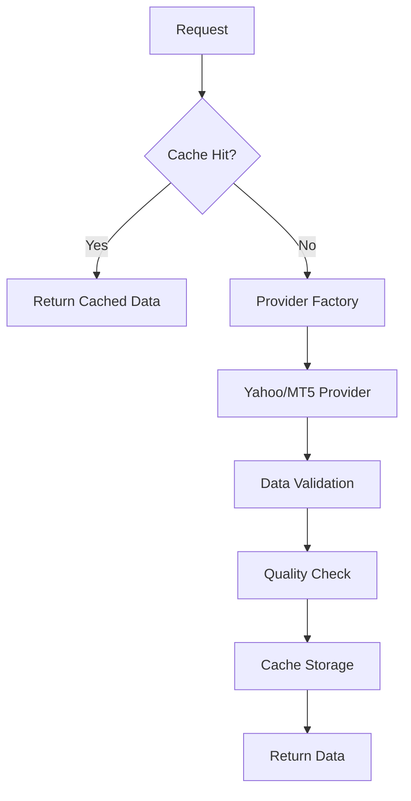
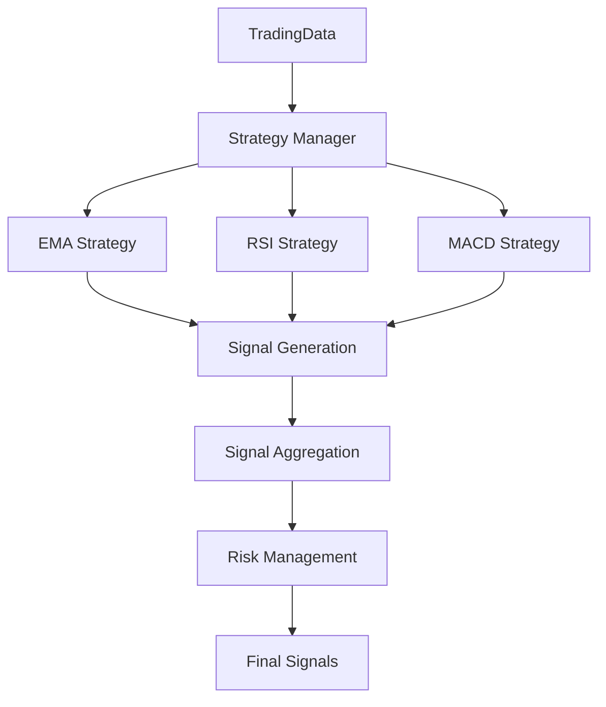

# Sistema de Trading con IA - Documentación Técnica

## 🏗️ Arquitectura del Sistema

### Estructura del Proyecto

```
IATrading/
├── src/                           # Código fuente principal
│   ├── core/                      # Componentes centrales
│   │   ├── base_classes.py        # Clases base del sistema
│   │   ├── config.py              # Configuración central
│   │   ├── exceptions.py          # Excepciones personalizadas
│   │   ├── paths.py               # Gestión de rutas
│   │   └── types.py               # Tipos de datos personalizados
│   ├── data/                      # Módulo de datos
│   │   ├── providers/             # Proveedores de datos
│   │   │   ├── yahoo.py           # Proveedor Yahoo Finance
│   │   │   ├── mt5.py             # Proveedor MetaTrader 5
│   │   │   └── factory.py         # Factory de proveedores
│   │   ├── cache.py               # Sistema de caché
│   │   ├── pipeline.py            # Pipeline de datos
│   │   └── quality.py             # Control de calidad
│   ├── strategies/                # Estrategias de trading
│   │   ├── ema/                   # Estrategia EMA
│   │   ├── rsi/                   # Estrategia RSI
│   │   ├── macd/                  # Estrategia MACD
│   │   ├── base.py                # Clase base de estrategias
│   │   └── manager.py             # Gestor de estrategias
│   ├── ml/                        # Machine Learning
│   │   ├── models.py              # Modelos ML
│   │   ├── features.py            # Ingeniería de características
│   │   ├── optimization.py       # Optimización de hiperparámetros
│   │   └── training.py            # Entrenamiento de modelos
│   ├── services/                  # Servicios del sistema
│   │   ├── orchestrator.py        # Orquestador principal
│   │   ├── config_service.py      # Servicio de configuración
│   │   └── evaluation_service.py  # Servicio de evaluación
│   ├── interfaces/                # Interfaces de usuario
│   │   ├── cli/                   # Interfaz de línea de comandos
│   │   ├── menu_interface.py      # Interfaz de menús
│   │   └── web_interface.py       # Interfaz web
│   └── trading/                   # Módulo de trading
│       ├── portfolio.py           # Gestión de portafolio
│       ├── risk.py                # Gestión de riesgo
│       └── signals.py             # Procesamiento de señales
├── tests/                         # Suite de tests
│   ├── unit/                      # Tests unitarios
│   ├── integration/               # Tests de integración
│   └── performance/               # Tests de rendimiento
├── docs/                          # Documentación
└── config/                        # Archivos de configuración
```

## 🔧 Componentes Principales

### 1. Core Types (src/core/types.py)

**TradingData**: Contenedor principal para datos de mercado
```python
@dataclass
class TradingData:
    symbol: str           # Símbolo del instrumento (ej: 'EURUSD')
    timeframe: str        # Marco temporal (ej: '1h', 'H1')
    data: pd.DataFrame    # Datos OHLCV
    provider: str         # Proveedor de datos
    timestamp: datetime   # Timestamp de obtención
```

**SignalData**: Contenedor para señales de trading
```python
@dataclass  
class SignalData:
    signals: pd.Series    # Serie de señales (-1: SELL, 0: HOLD, 1: BUY)
    metadata: Dict        # Metadatos de la estrategia
```

### 2. Data Providers (src/data/providers/)

#### YahooProvider
- **Propósito**: Obtener datos de Yahoo Finance
- **Capacidades**:
  - Forex: EURUSD, GBPUSD, etc.
  - Acciones: AAPL, GOOGL, etc.
  - Conversión automática de símbolos y timeframes
  - Control de calidad de datos

```python
# Ejemplo de uso
provider = YahooProvider()
data = provider.fetch_data('EURUSD', '1h', period_days=30)
```

#### MT5Provider  
- **Propósito**: Integración con MetaTrader 5
- **Estado**: Implementación básica
- **Capacidades**: Datos en tiempo real, ejecución de órdenes

### 3. Sistema de Caché (src/data/cache.py)

**DataCache**: Sistema de caché inteligente para datos de mercado
- **Características**:
  - TTL configurable
  - Compresión automática
  - Validación de integridad
  - Gestión automática de espacio

```python
# Configuración del caché
cache = DataCache(
    cache_dir='./cache',
    ttl_seconds=3600,      # 1 hora
    max_size_mb=500        # 500MB máximo
)
```

### 4. Estrategias de Trading (src/strategies/)

#### EMA Strategy (Exponential Moving Average)
```python
class EMAStrategy(BaseStrategy):
    def __init__(self, config=None):
        self.ema_fast = 12      # EMA rápida
        self.ema_slow = 26      # EMA lenta  
        self.signal_threshold = 0.001  # Umbral de señal
    
    def generate_signals(self, data: TradingData) -> SignalData:
        # Lógica: BUY cuando EMA_fast > EMA_slow
        # SELL cuando EMA_fast < EMA_slow
```

**Metadatos generados**:
- `ema_fast`, `ema_slow`: Valores actuales de EMAs
- `current_diff_pct`: Diferencia porcentual entre EMAs
- `trend`: Tendencia detectada (bullish/bearish)
- `signal_changes`: Número de cambios de señal

#### RSI Strategy (Relative Strength Index)
```python
class RSIStrategy(BaseStrategy):
    def __init__(self, config=None):
        self.rsi_period = 14        # Período RSI
        self.oversold = 30          # Nivel sobreventa
        self.overbought = 70        # Nivel sobrecompra
```

**Metadatos generados**:
- `current_rsi`: Valor actual del RSI (0-100)
- `market_condition`: overbought/oversold/normal
- `rsi_period`, `oversold_threshold`, `overbought_threshold`

#### MACD Strategy (Moving Average Convergence Divergence)
```python
class MACDStrategy(BaseStrategy):
    def __init__(self, config=None):
        self.fast_period = 12       # Período EMA rápida
        self.slow_period = 26       # Período EMA lenta
        self.signal_period = 9      # Período línea de señal
```

**Metadatos generados**:
- `current_macd`, `current_signal`, `current_histogram`
- `trend`: Tendencia basada en cruce de líneas
- `fast_period`, `slow_period`, `signal_period`

### 5. Orquestador (src/services/orchestrator.py)

**TradingOrchestrator**: Componente central que coordina todo el flujo

```python
class TradingOrchestrator:
    def run_full_pipeline(
        self,
        symbol: str,
        timeframe: str = 'H1',
        strategies: Optional[List[str]] = None,
        force_update: bool = False,
        provider: str = 'auto',
        period_days: int = 365,
        start_date: Optional[datetime] = None,
        end_date: Optional[datetime] = None
    ) -> Dict[str, Any]:
```

**Funcionalidades**:
- Gestión automática de datos (caché + providers)
- Ejecución paralela de estrategias
- Evaluación y optimización automática
- Reporting comprehensivo

### 6. Machine Learning (src/ml/)

#### Modelos Disponibles
- **RandomForestModel**: Clasificación de señales
- **XGBoostModel**: Gradiente boosting
- **LSTMModel**: Redes neuronales recurrentes

#### Feature Engineering (src/ml/features.py)
```python
class TechnicalFeatures:
    def create_features(self, data: pd.DataFrame) -> pd.DataFrame:
        # Indicadores técnicos
        # Características de precio
        # Features de volumen
        # Características temporales
```

## 🔍 Flujo de Datos

### 1. Pipeline de Datos


### 2. Pipeline de Estrategias


## 🧪 Sistema de Testing

### Estructura de Tests
```
tests/
├── conftest.py                    # Fixtures compartidas
├── unit/                          # Tests unitarios
│   ├── test_strategies_comprehensive.py
│   ├── test_data_pipeline_comprehensive.py
│   ├── test_orchestrator.py
│   └── test_feature_engineering.py
├── integration/                   # Tests de integración
│   └── test_full_pipeline.py
└── performance/                   # Tests de rendimiento
```

### Fixtures Principales (conftest.py)
- **sample_trading_data**: Datos de mercado realistas
- **trending_up_data**: Datos con tendencia alcista
- **trending_down_data**: Datos con tendencia bajista
- **volatile_data**: Datos de alta volatilidad
- **large_dataset**: Dataset grande para tests de performance

### Coverage Actual
```bash
Name                                      Coverage
-------------------------------------------------------------
src\data\providers\yahoo.py              95%     # ✅ Bien testeado
src\strategies\ema\strategy.py            88%     # ✅ Bien testeado
src\strategies\macd\strategy.py           89%     # ✅ Bien testeado
src\strategies\rsi\strategy.py            84%     # ✅ Bien testeado
src\services\orchestrator.py             24%     # ⚠️ Necesita más tests
src\ml\models.py                          23%     # ⚠️ Necesita más tests
```

## 🚀 APIs y Interfaces

### 1. Orchestrator API
```python
# Status del sistema
status = orchestrator.get_system_status()
# Retorna: {'status': 'healthy', 'components': {...}, 'cache': {...}}

# Pipeline completo
result = orchestrator.run_full_pipeline(
    symbol='EURUSD',
    strategies=['ema', 'rsi'],
    period_days=90
)
```

### 2. Strategy API
```python
# Todas las estrategias implementan esta interfaz
strategy = EMAStrategy(config={'ema_fast': 8, 'ema_slow': 21})
signals = strategy.generate_signals(trading_data)

# Información de la estrategia
info = strategy.get_strategy_info()
params = strategy.get_default_params()
```

### 3. Data Provider API
```python
# Interface común para todos los providers
provider = ProviderFactory.create_provider('yahoo')
data = provider.fetch_data('EURUSD', '1h', period_days=30)
quality_score = provider.calculate_quality_score(data.data)
```

## 🔒 Gestión de Configuración

### Configuración Central (src/core/config.py)
```python
class TradingConfig:
    DATA_PROVIDERS = ['yahoo', 'mt5']
    DEFAULT_TIMEFRAMES = ['1m', '5m', '15m', '1h', '4h', '1d']
    CACHE_TTL = 3600  # 1 hora
    MAX_CACHE_SIZE = 500  # MB
```

### Variables de Entorno
```bash
TRADING_LOG_LEVEL=INFO
TRADING_CACHE_DIR=./cache
YAHOO_API_TIMEOUT=30
MT5_LOGIN=12345
MT5_PASSWORD=secret
```

## 📊 Monitoreo y Logging

### Sistema de Logging
- **Nivel INFO**: Operaciones normales
- **Nivel WARNING**: Situaciones de atención
- **Nivel ERROR**: Errores recuperables
- **Nivel CRITICAL**: Errores críticos del sistema

### Métricas del Sistema
- Cache hit rate
- Tiempo de respuesta de providers
- Número de señales generadas
- Calidad de datos (score 0-1)
- Uso de memoria

## 🔧 Troubleshooting

### Problemas Comunes

1. **Cache Miss Alto**
   - Verificar TTL configuration
   - Revisar espacio en disco
   - Validar permisos de escritura

2. **Estrategias Sin Señales**
   - Validar datos de entrada
   - Revisar parámetros de estrategia
   - Verificar período mínimo de datos

3. **Provider Timeout**
   - Verificar conectividad de red
   - Ajustar timeout en configuración
   - Implementar retry logic

### Debug Mode
```python
# Activar modo debug
import logging
logging.getLogger('trading').setLevel(logging.DEBUG)
```