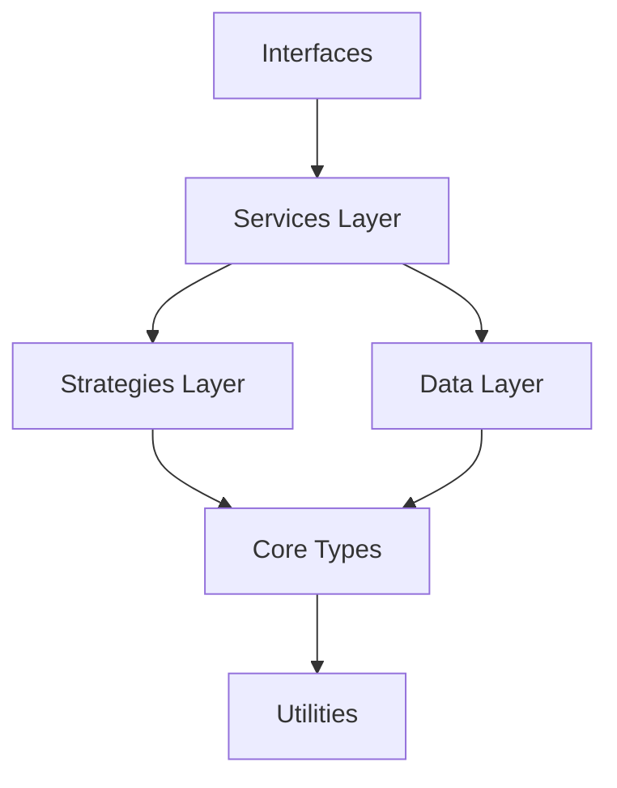
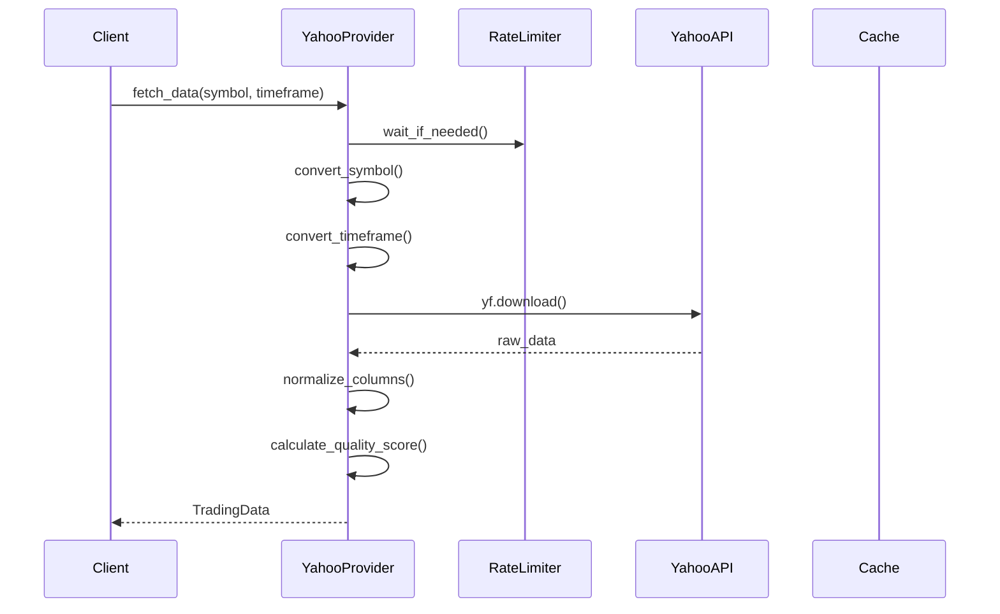
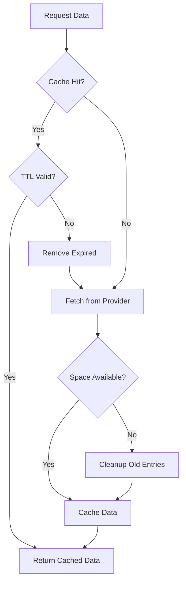
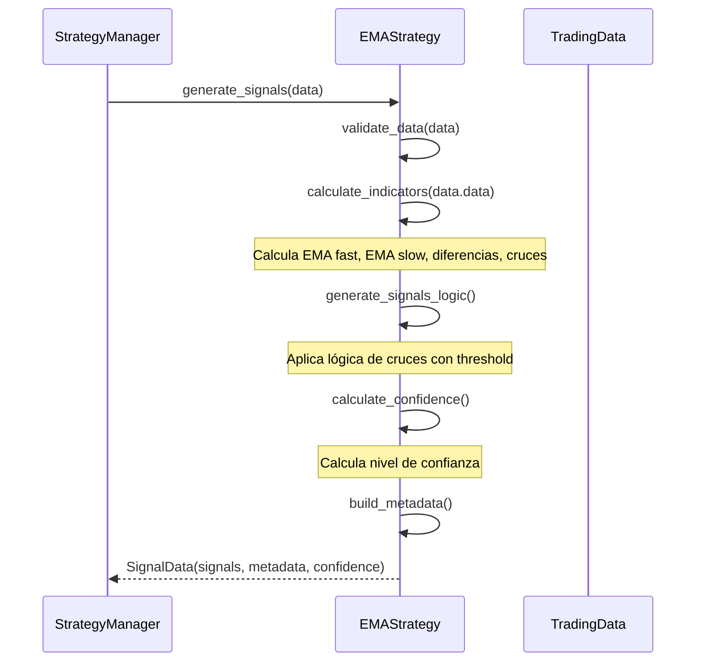
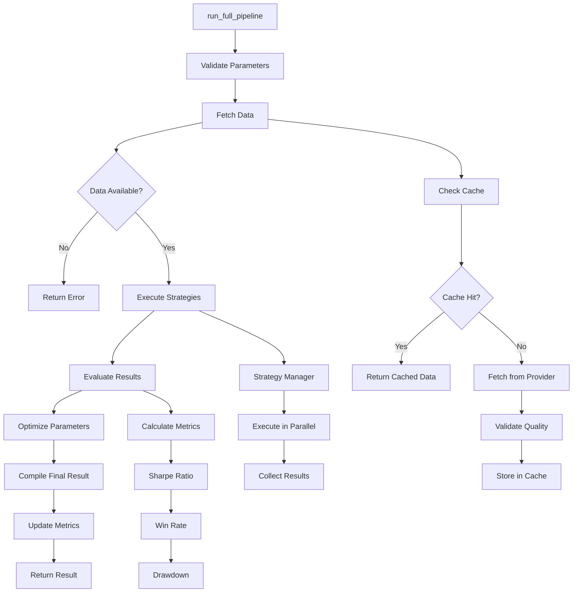

# Sistema de Trading con IA - Documentación Técnica Detallada

## 🏗️ Arquitectura del Sistema

### Patrón de Diseño General
El sistema utiliza una **arquitectura por capas** con los siguientes patrones:
- **Factory Pattern**: Para creación de providers y estrategias
- **Strategy Pattern**: Para diferentes algoritmos de trading
- **Observer Pattern**: Para notificaciones de señales
- **Singleton Pattern**: Para configuración y cache
- **Repository Pattern**: Para acceso a datos



## 📁 Core Module (src/core/)

### 1. Types (src/core/types.py)

#### TradingData Class
```python
@dataclass
class TradingData:
    symbol: str           # Instrumento financiero (ej: 'EURUSD')
    timeframe: str        # Marco temporal (ej: '1h', 'H1')
    data: pd.DataFrame    # DataFrame con OHLCV
    provider: str         # Proveedor de datos ('yahoo', 'mt5')
    timestamp: datetime   # Momento de obtención
    quality_score: float = 0.0  # Score de calidad (0-1)
```

**Responsabilidades**:
- Encapsular datos de mercado con metadatos
- Validar estructura de datos OHLCV
- Mantener trazabilidad del origen de datos

**Invariantes**:
- `data` debe contener columnas: `['open', 'high', 'low', 'close', 'volume']`
- `high >= max(open, close)` y `low <= min(open, close)`
- `quality_score` entre 0.0 y 1.0

#### SignalData Class
```python
@dataclass
class SignalData:
    signals: pd.Series    # Serie temporal de señales [-1, 0, 1]
    metadata: Dict        # Metadatos de la estrategia
    confidence: float = 0.0  # Nivel de confianza global
    strategy_name: str = ""  # Nombre de la estrategia
```

**Responsabilidades**:
- Encapsular señales de trading con contexto
- Proporcionar metadatos para análisis posterior
- Mantener información de confianza

### 2. Base Classes (src/core/base_classes.py)

#### BaseStrategy (Abstract)
```python
class BaseStrategy(ABC):
    def __init__(self, config: Optional[Dict] = None):
        self.config = config or {}
        self.logger = logging.getLogger(self.__class__.__name__)
    
    @abstractmethod
    def generate_signals(self, data: TradingData) -> SignalData:
        """Genera señales de trading a partir de datos"""
        pass
    
    @abstractmethod
    def calculate_indicators(self, data: pd.DataFrame) -> pd.DataFrame:
        """Calcula indicadores técnicos"""
        pass
    
    def validate_data(self, data: TradingData) -> bool:
        """Valida que los datos sean apropiados para la estrategia"""
        if data is None or data.data.empty:
            return False
        required_columns = ['open', 'high', 'low', 'close', 'volume']
        return all(col in data.data.columns for col in required_columns)
```

**Flujo de Ejecución**:
1. **Validación**: `validate_data()` verifica estructura
2. **Cálculo**: `calculate_indicators()` añade indicadores técnicos
3. **Señales**: `generate_signals()` produce señales de trading
4. **Metadata**: Enriquecer con información contextual

#### BaseProvider (Abstract)
```python
class BaseProvider(ABC):
    @abstractmethod
    def fetch_data(self, symbol: str, timeframe: str, **kwargs) -> Optional[TradingData]:
        """Obtiene datos del proveedor"""
        pass
    
    @abstractmethod
    def is_available(self) -> bool:
        """Verifica si el proveedor está disponible"""
        pass
    
    def calculate_quality_score(self, data: pd.DataFrame) -> float:
        """Calcula score de calidad de los datos"""
        if data.empty:
            return 0.0
        
        # Penalizar datos faltantes
        missing_ratio = data.isnull().sum().sum() / (len(data) * len(data.columns))
        missing_penalty = max(0, 1 - missing_ratio * 2)
        
        # Penalizar datos duplicados
        duplicate_ratio = data.duplicated().sum() / len(data)
        duplicate_penalty = max(0, 1 - duplicate_ratio * 5)
        
        # Score final
        return min(1.0, missing_penalty * duplicate_penalty)
```

### 3. Configuration (src/core/config.py)

#### TradingConfig Class
```python
class TradingConfig:
    """Configuración central del sistema"""
    
    # Providers
    DATA_PROVIDERS = ['yahoo', 'mt5', 'file']
    DEFAULT_PROVIDER = 'yahoo'
    
    # Timeframes soportados
    TIMEFRAMES = {
        '1m': 'M1',   '5m': 'M5',   '15m': 'M15',  '30m': 'M30',
        '1h': 'H1',   '4h': 'H4',   '1d': 'D1',    '1w': 'W1'
    }
    
    # Cache configuration
    CACHE_TTL = 3600  # 1 hora
    CACHE_MAX_SIZE = 500  # MB
    
    # Estrategias disponibles
    AVAILABLE_STRATEGIES = ['ema', 'rsi', 'macd', 'bollinger', 'stochastic']
    
    # Risk management
    MAX_POSITION_SIZE = 0.02  # 2% del capital
    DEFAULT_STOP_LOSS = 0.01  # 1%
    DEFAULT_TAKE_PROFIT = 0.02  # 2%
```

### 4. Exception Handling (src/core/exceptions.py)

#### Custom Exceptions
```python
class TradingException(Exception):
    """Excepción base del sistema de trading"""
    def __init__(self, message: str, error_code: str = None):
        super().__init__(message)
        self.error_code = error_code
        self.timestamp = datetime.now()

class DataProviderError(TradingException):
    """Error en proveedor de datos"""
    pass

class StrategyError(TradingException):
    """Error en estrategia de trading"""
    pass

class CacheError(TradingException):
    """Error en sistema de cache"""
    pass

class ValidationError(TradingException):
    """Error de validación de datos"""
    pass
```

## 🗄️ Data Layer (src/data/)

### 1. Data Providers (src/data/providers/)

#### Yahoo Finance Provider (yahoo.py)
```python
class YahooProvider(BaseProvider):
    def __init__(self):
        self.session = requests.Session()
        self.session.headers.update({'User-Agent': 'Trading-System/1.0'})
        self.rate_limiter = RateLimiter(max_calls=100, period=60)  # 100 calls/min
    
    def fetch_data(self, symbol: str, timeframe: str, period_days: int = 30,
                   start_date: datetime = None, end_date: datetime = None) -> Optional[TradingData]:
        """
        Obtiene datos de Yahoo Finance
        
        Args:
            symbol: Símbolo del instrumento
            timeframe: Marco temporal
            period_days: Días hacia atrás desde hoy
            start_date: Fecha inicio específica
            end_date: Fecha fin específica
            
        Returns:
            TradingData object o None si hay error
        """
        try:
            # Rate limiting
            self.rate_limiter.wait_if_needed()
            
            # Convertir símbolo para Yahoo
            yahoo_symbol = self.convert_symbol(symbol)
            yahoo_interval = self.convert_timeframe(timeframe)
            
            # Determinar fechas
            if start_date and end_date:
                data = yf.download(yahoo_symbol, start=start_date, end=end_date, 
                                 interval=yahoo_interval, progress=False)
            else:
                data = yf.download(yahoo_symbol, period=f"{period_days}d", 
                                 interval=yahoo_interval, progress=False)
            
            if data.empty:
                self.logger.warning(f"No data received for {symbol}")
                return None
            
            # Normalizar columnas
            data = self.normalize_columns(data)
            
            # Calcular quality score
            quality_score = self.calculate_quality_score(data)
            
            return TradingData(
                symbol=symbol,
                timeframe=timeframe,
                data=data,
                provider='yahoo',
                timestamp=datetime.now(),
                quality_score=quality_score
            )
            
        except Exception as e:
            self.logger.error(f"Error fetching data for {symbol}: {e}")
            raise DataProviderError(f"Yahoo fetch failed: {e}")
    
    def convert_symbol(self, symbol: str) -> str:
        """Convierte símbolo a formato Yahoo"""
        # Forex pairs need =X suffix
        forex_pairs = ['EURUSD', 'GBPUSD', 'USDJPY', 'AUDUSD', 'USDCAD', 'USDCHF', 'NZDUSD']
        if symbol in forex_pairs:
            return f"{symbol}=X"
        return symbol
    
    def convert_timeframe(self, timeframe: str) -> str:
        """Convierte timeframe a formato Yahoo"""
        mapping = {
            '1m': '1m', '5m': '5m', '15m': '15m', '30m': '30m',
            '1h': '1h', 'H1': '1h', '4h': '4h', 'H4': '4h',
            '1d': '1d', 'D1': '1d', '1w': '1wk'
        }
        return mapping.get(timeframe, '1h')
```

**Flujo de Datos Yahoo Provider**:


#### MetaTrader 5 Provider (mt5.py)
```python
class MT5Provider(BaseProvider):
    def __init__(self):
        self.connected = False
        self.account_info = None
    
    def connect(self, login: int, password: str, server: str) -> bool:
        """Conecta a MetaTrader 5"""
        try:
            if not mt5.initialize():
                raise DataProviderError("MT5 initialization failed")
            
            if not mt5.login(login, password, server):
                raise DataProviderError("MT5 login failed")
            
            self.connected = True
            self.account_info = mt5.account_info()
            return True
            
        except Exception as e:
            self.logger.error(f"MT5 connection error: {e}")
            return False
    
    def fetch_data(self, symbol: str, timeframe: str, count: int = 1000) -> Optional[TradingData]:
        """Obtiene datos de MT5"""
        if not self.connected:
            raise DataProviderError("MT5 not connected")
        
        try:
            # Convertir timeframe
            mt5_timeframe = self.convert_timeframe(timeframe)
            
            # Obtener datos
            rates = mt5.copy_rates_from_pos(symbol, mt5_timeframe, 0, count)
            
            if rates is None or len(rates) == 0:
                return None
            
            # Convertir a DataFrame
            data = pd.DataFrame(rates)
            data['time'] = pd.to_datetime(data['time'], unit='s')
            data.set_index('time', inplace=True)
            
            # Renombrar columnas
            data.columns = ['open', 'high', 'low', 'close', 'tick_volume', 'spread', 'real_volume']
            data['volume'] = data['real_volume'].fillna(data['tick_volume'])
            
            return TradingData(
                symbol=symbol,
                timeframe=timeframe,
                data=data[['open', 'high', 'low', 'close', 'volume']],
                provider='mt5',
                timestamp=datetime.now(),
                quality_score=self.calculate_quality_score(data)
            )
            
        except Exception as e:
            self.logger.error(f"MT5 fetch error: {e}")
            raise DataProviderError(f"MT5 fetch failed: {e}")
```

#### Provider Factory (factory.py)
```python
class ProviderFactory:
    """Factory para crear providers de datos"""
    
    _providers = {
        'yahoo': YahooProvider,
        'mt5': MT5Provider,
        'file': FileProvider
    }
    
    @classmethod
    def create_provider(cls, provider_name: str, **kwargs) -> BaseProvider:
        """Crea una instancia del provider especificado"""
        if provider_name not in cls._providers:
            raise ValueError(f"Unknown provider: {provider_name}")
        
        provider_class = cls._providers[provider_name]
        return provider_class(**kwargs)
    
    @classmethod
    def get_available_providers(cls) -> List[str]:
        """Retorna lista de providers disponibles"""
        return list(cls._providers.keys())
    
    @classmethod
    def register_provider(cls, name: str, provider_class: Type[BaseProvider]):
        """Registra un nuevo provider"""
        cls._providers[name] = provider_class
```

### 2. Cache System (src/data/cache.py)

#### DataCache Class
```python
class DataCache:
    """Sistema de cache inteligente para datos de trading"""
    
    def __init__(self, cache_dir: str = "./cache", ttl_seconds: int = 3600, 
                 max_size_mb: int = 500):
        self.cache_dir = Path(cache_dir)
        self.cache_dir.mkdir(exist_ok=True)
        self.ttl_seconds = ttl_seconds
        self.max_size_mb = max_size_mb
        self.logger = logging.getLogger(__name__)
        
        # Cache statistics
        self.stats = {
            'hits': 0,
            'misses': 0,
            'writes': 0,
            'errors': 0
        }
    
    def get(self, key: str) -> Optional[TradingData]:
        """Obtiene datos del cache"""
        try:
            cache_path = self._get_cache_path(key)
            
            if not cache_path.exists():
                self.stats['misses'] += 1
                return None
            
            # Verificar TTL
            if self._is_expired(cache_path):
                self.logger.debug(f"Cache entry expired: {key}")
                cache_path.unlink()
                self.stats['misses'] += 1
                return None
            
            # Cargar datos
            with gzip.open(cache_path, 'rb') as f:
                data = pickle.load(f)
            
            self.stats['hits'] += 1
            self.logger.debug(f"Cache hit: {key}")
            return data
            
        except Exception as e:
            self.logger.error(f"Cache get error for {key}: {e}")
            self.stats['errors'] += 1
            return None
    
    def set(self, key: str, data: TradingData) -> bool:
        """Almacena datos en cache"""
        try:
            # Verificar espacio disponible
            if not self._check_space():
                self._cleanup_old_entries()
            
            cache_path = self._get_cache_path(key)
            
            # Serializar y comprimir
            with gzip.open(cache_path, 'wb') as f:
                pickle.dump(data, f, protocol=pickle.HIGHEST_PROTOCOL)
            
            self.stats['writes'] += 1
            self.logger.debug(f"Cache write: {key}")
            return True
            
        except Exception as e:
            self.logger.error(f"Cache set error for {key}: {e}")
            self.stats['errors'] += 1
            return False
    
    def _get_cache_path(self, key: str) -> Path:
        """Genera path del archivo de cache"""
        safe_key = hashlib.md5(key.encode()).hexdigest()
        return self.cache_dir / f"{safe_key}.cache"
    
    def _is_expired(self, cache_path: Path) -> bool:
        """Verifica si el archivo de cache ha expirado"""
        file_age = time.time() - cache_path.stat().st_mtime
        return file_age > self.ttl_seconds
    
    def _check_space(self) -> bool:
        """Verifica si hay espacio suficiente en cache"""
        total_size = sum(f.stat().st_size for f in self.cache_dir.rglob('*.cache'))
        total_size_mb = total_size / (1024 * 1024)
        return total_size_mb < self.max_size_mb
    
    def _cleanup_old_entries(self):
        """Limpia entradas antiguas del cache"""
        cache_files = list(self.cache_dir.glob('*.cache'))
        cache_files.sort(key=lambda x: x.stat().st_mtime)
        
        # Eliminar el 20% más antiguo
        files_to_remove = cache_files[:len(cache_files) // 5]
        for file_path in files_to_remove:
            file_path.unlink()
        
        self.logger.info(f"Cleaned up {len(files_to_remove)} old cache entries")
    
    def get_stats(self) -> Dict:
        """Retorna estadísticas del cache"""
        hit_rate = self.stats['hits'] / (self.stats['hits'] + self.stats['misses']) if (self.stats['hits'] + self.stats['misses']) > 0 else 0
        return {
            **self.stats,
            'hit_rate': hit_rate,
            'total_requests': self.stats['hits'] + self.stats['misses']
        }
```

**Flujo del Sistema de Cache**:


### 3. Data Pipeline (src/data/pipeline.py)

#### DataPipeline Class
```python
class DataPipeline:
    """Pipeline para procesamiento de datos de trading"""
    
    def __init__(self, cache_enabled: bool = True):
        self.cache = DataCache() if cache_enabled else None
        self.provider_factory = ProviderFactory()
        self.quality_checker = DataQualityChecker()
        self.logger = logging.getLogger(__name__)
    
    def get_data(self, symbol: str, timeframe: str, provider: str = 'auto',
                 force_update: bool = False, **kwargs) -> Optional[TradingData]:
        """
        Obtiene datos con pipeline completo
        
        Flujo:
        1. Verificar cache (si no force_update)
        2. Si cache miss, obtener de provider
        3. Validar calidad de datos
        4. Almacenar en cache
        5. Retornar datos
        """
        cache_key = self._generate_cache_key(symbol, timeframe, **kwargs)
        
        # Paso 1: Verificar cache
        if not force_update and self.cache:
            cached_data = self.cache.get(cache_key)
            if cached_data:
                self.logger.info(f"Cache hit for {symbol}:{timeframe}")
                return cached_data
        
        # Paso 2: Obtener de provider
        if provider == 'auto':
            provider = self._select_best_provider(symbol)
        
        data_provider = self.provider_factory.create_provider(provider)
        
        if not data_provider.is_available():
            raise DataProviderError(f"Provider {provider} not available")
        
        raw_data = data_provider.fetch_data(symbol, timeframe, **kwargs)
        
        if raw_data is None:
            self.logger.warning(f"No data received from {provider} for {symbol}")
            return None
        
        # Paso 3: Validar calidad
        quality_issues = self.quality_checker.check_data(raw_data.data)
        if quality_issues['severity'] == 'critical':
            raise ValidationError(f"Critical data quality issues: {quality_issues}")
        
        # Paso 4: Enriquecer con metadata
        enriched_data = self._enrich_data(raw_data)
        
        # Paso 5: Cache
        if self.cache:
            self.cache.set(cache_key, enriched_data)
        
        return enriched_data
    
    def _select_best_provider(self, symbol: str) -> str:
        """Selecciona el mejor provider para el símbolo"""
        # Forex -> Yahoo Finance tiene buena cobertura
        forex_pairs = ['EURUSD', 'GBPUSD', 'USDJPY', 'AUDUSD']
        if symbol in forex_pairs:
            return 'yahoo'
        
        # Acciones -> Yahoo también
        if symbol.isalpha() and len(symbol) <= 5:
            return 'yahoo'
        
        return 'yahoo'  # Default
    
    def _enrich_data(self, data: TradingData) -> TradingData:
        """Enriquece datos con información adicional"""
        # Calcular volatilidad
        returns = data.data['close'].pct_change().dropna()
        volatility = returns.std() * np.sqrt(252)  # Anualizada
        
        # Añadir metadata
        enriched_data = TradingData(
            symbol=data.symbol,
            timeframe=data.timeframe,
            data=data.data,
            provider=data.provider,
            timestamp=data.timestamp,
            quality_score=data.quality_score
        )
        
        # Añadir información adicional como atributos
        enriched_data.volatility = volatility
        enriched_data.data_points = len(data.data)
        enriched_data.date_range = (data.data.index.min(), data.data.index.max())
        
        return enriched_data
```

## 🎯 Strategies Layer (src/strategies/)

### 1. Strategy Manager (manager.py)

#### StrategyManager Class
```python
class StrategyManager:
    """Gestor central de estrategias de trading"""
    
    def __init__(self):
        self.strategies = {}
        self.logger = logging.getLogger(__name__)
        self._load_available_strategies()
    
    def execute_strategies(self, data: TradingData, 
                          strategy_names: List[str] = None) -> Dict[str, SignalData]:
        """
        Ejecuta múltiples estrategias en paralelo
        
        Args:
            data: Datos de trading
            strategy_names: Lista de estrategias a ejecutar (None = todas)
            
        Returns:
            Dict con resultados de cada estrategia
        """
        if strategy_names is None:
            strategy_names = list(self.strategies.keys())
        
        results = {}
        errors = {}
        
        # Ejecutar estrategias en paralelo
        with ThreadPoolExecutor(max_workers=4) as executor:
            # Enviar tareas
            future_to_strategy = {}
            for name in strategy_names:
                if name in self.strategies:
                    strategy = self.strategies[name]
                    future = executor.submit(self._execute_single_strategy, strategy, data)
                    future_to_strategy[future] = name
            
            # Recoger resultados
            for future in as_completed(future_to_strategy):
                strategy_name = future_to_strategy[future]
                try:
                    result = future.result(timeout=30)  # 30s timeout
                    results[strategy_name] = result
                    self.logger.info(f"Strategy {strategy_name} completed successfully")
                except Exception as e:
                    errors[strategy_name] = str(e)
                    self.logger.error(f"Strategy {strategy_name} failed: {e}")
        
        # Log summary
        self.logger.info(f"Executed {len(results)} strategies successfully, {len(errors)} failed")
        
        return results
    
    def _execute_single_strategy(self, strategy: BaseStrategy, data: TradingData) -> SignalData:
        """Ejecuta una estrategia individual con error handling"""
        try:
            # Validar datos
            if not strategy.validate_data(data):
                raise StrategyError("Data validation failed")
            
            # Ejecutar estrategia
            start_time = time.time()
            signals = strategy.generate_signals(data)
            execution_time = time.time() - start_time
            
            # Añadir métricas de ejecución
            signals.metadata['execution_time'] = execution_time
            signals.metadata['data_points'] = len(data.data)
            
            return signals
            
        except Exception as e:
            self.logger.error(f"Strategy execution error: {e}")
            raise StrategyError(f"Strategy execution failed: {e}")
    
    def register_strategy(self, name: str, strategy_class: Type[BaseStrategy], 
                         config: Dict = None):
        """Registra una nueva estrategia"""
        try:
            strategy_instance = strategy_class(config)
            self.strategies[name] = strategy_instance
            self.logger.info(f"Registered strategy: {name}")
        except Exception as e:
            self.logger.error(f"Failed to register strategy {name}: {e}")
            raise
    
    def get_strategy_info(self, strategy_name: str) -> Dict:
        """Obtiene información detallada de una estrategia"""
        if strategy_name not in self.strategies:
            raise ValueError(f"Strategy {strategy_name} not found")
        
        strategy = self.strategies[strategy_name]
        return strategy.get_strategy_info()
```

### 2. EMA Strategy (strategies/ema/strategy.py)

#### EMAStrategy Implementation
```python
class EMAStrategy(BaseStrategy):
    """
    Estrategia basada en Exponential Moving Averages
    
    Lógica:
    - BUY: Cuando EMA rápida cruza por encima de EMA lenta
    - SELL: Cuando EMA rápida cruza por debajo de EMA lenta
    - HOLD: Cuando no hay cruce significativo
    """
    
    def __init__(self, config: Optional[Dict] = None):
        super().__init__(config)
        
        # Parámetros de la estrategia
        self.ema_fast = self.config.get('ema_fast', 12)
        self.ema_slow = self.config.get('ema_slow', 26)
        self.signal_threshold = self.config.get('signal_threshold', 0.001)  # 0.1%
        
        # Validar parámetros
        if self.ema_fast >= self.ema_slow:
            raise ValueError("ema_fast must be less than ema_slow")
    
    def calculate_indicators(self, data: pd.DataFrame) -> pd.DataFrame:
        """Calcula EMAs y diferencias"""
        df = data.copy()
        
        # Calcular EMAs
        df['ema_fast'] = df['close'].ewm(span=self.ema_fast).mean()
        df['ema_slow'] = df['close'].ewm(span=self.ema_slow).mean()
        
        # Calcular diferencia absoluta y porcentual
        df['ema_diff'] = df['ema_fast'] - df['ema_slow']
        df['ema_diff_pct'] = (df['ema_diff'] / df['ema_slow']) * 100
        
        # Detectar cruces
        df['cross_above'] = (df['ema_diff'] > 0) & (df['ema_diff'].shift(1) <= 0)
        df['cross_below'] = (df['ema_diff'] < 0) & (df['ema_diff'].shift(1) >= 0)
        
        return df
    
    def generate_signals(self, data: TradingData) -> SignalData:
        """Genera señales de trading basadas en EMAs"""
        df = self.calculate_indicators(data.data)
        
        # Inicializar señales
        signals = pd.Series(0, index=df.index)
        
        # Generar señales basadas en cruces y threshold
        for i in range(1, len(df)):
            current_diff_pct = abs(df['ema_diff_pct'].iloc[i])
            
            if df['cross_above'].iloc[i] and current_diff_pct > self.signal_threshold * 100:
                signals.iloc[i] = 1  # BUY
            elif df['cross_below'].iloc[i] and current_diff_pct > self.signal_threshold * 100:
                signals.iloc[i] = -1  # SELL
            else:
                signals.iloc[i] = 0  # HOLD
        
        # Calcular tendencia general
        recent_diff = df['ema_diff_pct'].tail(10).mean()
        trend = 'bullish' if recent_diff > 0.05 else 'bearish' if recent_diff < -0.05 else 'neutral'
        
        # Contar cambios de señal
        signal_changes = (signals.diff() != 0).sum()
        
        # Metadata
        metadata = {
            'ema_fast': self.ema_fast,
            'ema_slow': self.ema_slow,
            'signal_threshold': self.signal_threshold,
            'current_fast_ema': float(df['ema_fast'].iloc[-1]),
            'current_slow_ema': float(df['ema_slow'].iloc[-1]),
            'current_diff_pct': float(df['ema_diff_pct'].iloc[-1]),
            'last_signal': int(signals.iloc[-1]),
            'signal_changes': int(signal_changes),
            'trend': trend,
            'cross_above_count': int(df['cross_above'].sum()),
            'cross_below_count': int(df['cross_below'].sum())
        }
        
        return SignalData(
            signals=signals,
            metadata=metadata,
            strategy_name='EMA',
            confidence=self._calculate_confidence(df, signals)
        )
    
    def _calculate_confidence(self, df: pd.DataFrame, signals: pd.Series) -> float:
        """Calcula nivel de confianza de las señales"""
        # Factores que afectan la confianza:
        # 1. Magnitud de la separación entre EMAs
        # 2. Consistencia de la tendencia
        # 3. Volumen (si está disponible)
        
        # Factor 1: Separación EMA
        avg_separation = abs(df['ema_diff_pct'].tail(20)).mean()
        separation_confidence = min(1.0, avg_separation / 1.0)  # 1% = 100% confidence
        
        # Factor 2: Consistencia de tendencia
        trend_consistency = abs(df['ema_diff_pct'].tail(10).mean()) / (df['ema_diff_pct'].tail(10).std() + 0.001)
        trend_confidence = min(1.0, trend_consistency / 2.0)
        
        # Factor 3: Número apropiado de señales (ni muy pocas ni muchas)
        signal_count = (signals != 0).sum()
        signal_ratio = signal_count / len(signals)
        signal_confidence = 1.0 - abs(signal_ratio - 0.2) * 2  # Óptimo ~20% señales
        signal_confidence = max(0.0, signal_confidence)
        
        # Confianza final (promedio ponderado)
        final_confidence = (separation_confidence * 0.4 + 
                          trend_confidence * 0.4 + 
                          signal_confidence * 0.2)
        
        return round(final_confidence, 3)
    
    def get_strategy_info(self) -> Dict:
        """Información de la estrategia"""
        return {
            'name': 'EMA',
            'description': 'Exponential Moving Average crossover strategy',
            'parameters': {
                'ema_fast': {'default': 12, 'range': [5, 50], 'description': 'Fast EMA period'},
                'ema_slow': {'default': 26, 'range': [20, 200], 'description': 'Slow EMA period'},
                'signal_threshold': {'default': 0.001, 'range': [0.0001, 0.01], 'description': 'Minimum percentage difference for signal'}
            },
            'signals': {
                1: 'BUY - Fast EMA crossed above Slow EMA',
                0: 'HOLD - No significant crossover',
                -1: 'SELL - Fast EMA crossed below Slow EMA'
            },
            'requirements': {
                'min_periods': max(self.ema_fast, self.ema_slow) * 2,
                'data_columns': ['close']
            }
        }
```

**Flujo de Ejecución EMA Strategy**:


## 🤖 Machine Learning Layer (src/ml/)

### 1. Feature Engineering (ml/features.py)

#### TechnicalFeatures Class
```python
class TechnicalFeatures:
    """Generador de características técnicas para ML"""
    
    def __init__(self):
        self.feature_config = {
            'price_features': True,
            'volume_features': True,
            'volatility_features': True,
            'momentum_features': True,
            'trend_features': True
        }
        self.logger = logging.getLogger(__name__)
    
    def create_features(self, data: pd.DataFrame) -> pd.DataFrame:
        """
        Crea conjunto completo de características técnicas
        
        Args:
            data: DataFrame con OHLCV
            
        Returns:
            DataFrame con características para ML
        """
        df = data.copy()
        
        # Price-based features
        if self.feature_config['price_features']:
            df = self._add_price_features(df)
        
        # Volume features
        if self.feature_config['volume_features']:
            df = self._add_volume_features(df)
        
        # Volatility features
        if self.feature_config['volatility_features']:
            df = self._add_volatility_features(df)
        
        # Momentum features
        if self.feature_config['momentum_features']:
            df = self._add_momentum_features(df)
        
        # Trend features
        if self.feature_config['trend_features']:
            df = self._add_trend_features(df)
        
        # Technical indicators
        df = self._add_technical_indicators(df)
        
        # Temporal features
        df = self._add_temporal_features(df)
        
        # Clean data
        df = self._clean_features(df)
        
        return df
    
    def _add_price_features(self, df: pd.DataFrame) -> pd.DataFrame:
        """Características basadas en precio"""
        # Returns
        df['return_1'] = df['close'].pct_change()
        df['return_5'] = df['close'].pct_change(5)
        df['return_10'] = df['close'].pct_change(10)
        
        # Price ratios
        df['high_low_ratio'] = df['high'] / df['low']
        df['close_open_ratio'] = df['close'] / df['open']
        
        # Body and shadow ratios
        df['body_ratio'] = abs(df['close'] - df['open']) / (df['high'] - df['low'] + 1e-8)
        df['upper_shadow'] = (df['high'] - np.maximum(df['open'], df['close'])) / (df['high'] - df['low'] + 1e-8)
        df['lower_shadow'] = (np.minimum(df['open'], df['close']) - df['low']) / (df['high'] - df['low'] + 1e-8)
        
        # Price position within range
        df['price_position'] = (df['close'] - df['low']) / (df['high'] - df['low'] + 1e-8)
        
        return df
    
    def _add_volume_features(self, df: pd.DataFrame) -> pd.DataFrame:
        """Características basadas en volumen"""
        if 'volume' not in df.columns:
            return df
        
        # Volume moving averages
        df['volume_ma_5'] = df['volume'].rolling(5).mean()
        df['volume_ma_20'] = df['volume'].rolling(20).mean()
        
        # Volume ratios
        df['volume_ratio_5'] = df['volume'] / (df['volume_ma_5'] + 1e-8)
        df['volume_ratio_20'] = df['volume'] / (df['volume_ma_20'] + 1e-8)
        
        # Price-volume features
        df['price_volume'] = df['return_1'] * df['volume']
        df['volume_weighted_price'] = (df['high'] + df['low'] + df['close']) / 3 * df['volume']
        
        return df
    
    def _add_volatility_features(self, df: pd.DataFrame) -> pd.DataFrame:
        """Características de volatilidad"""
        # True Range
        df['true_range'] = np.maximum(
            df['high'] - df['low'],
            np.maximum(
                abs(df['high'] - df['close'].shift(1)),
                abs(df['low'] - df['close'].shift(1))
            )
        )
        
        # Average True Range
        df['atr_14'] = df['true_range'].rolling(14).mean()
        df['atr_ratio'] = df['true_range'] / (df['atr_14'] + 1e-8)
        
        # Realized volatility
        df['volatility_5'] = df['return_1'].rolling(5).std()
        df['volatility_20'] = df['return_1'].rolling(20).std()
        
        # Volatility ratios
        df['vol_ratio'] = df['volatility_5'] / (df['volatility_20'] + 1e-8)
        
        return df
    
    def _add_momentum_features(self, df: pd.DataFrame) -> pd.DataFrame:
        """Características de momentum"""
        # RSI
        delta = df['close'].diff()
        gain = (delta.where(delta > 0, 0)).rolling(14).mean()
        loss = (-delta.where(delta < 0, 0)).rolling(14).mean()
        rs = gain / (loss + 1e-8)
        df['rsi'] = 100 - (100 / (1 + rs))
        
        # Stochastic
        low_14 = df['low'].rolling(14).min()
        high_14 = df['high'].rolling(14).max()
        df['stoch_k'] = 100 * (df['close'] - low_14) / (high_14 - low_14 + 1e-8)
        df['stoch_d'] = df['stoch_k'].rolling(3).mean()
        
        # Williams %R
        df['williams_r'] = -100 * (high_14 - df['close']) / (high_14 - low_14 + 1e-8)
        
        return df
    
    def _add_trend_features(self, df: pd.DataFrame) -> pd.DataFrame:
        """Características de tendencia"""
        # Moving averages
        for period in [5, 10, 20, 50]:
            df[f'ma_{period}'] = df['close'].rolling(period).mean()
            df[f'ma_ratio_{period}'] = df['close'] / (df[f'ma_{period}'] + 1e-8)
        
        # EMA
        df['ema_12'] = df['close'].ewm(span=12).mean()
        df['ema_26'] = df['close'].ewm(span=26).mean()
        df['ema_diff'] = (df['ema_12'] - df['ema_26']) / (df['ema_26'] + 1e-8)
        
        # MACD
        df['macd'] = df['ema_12'] - df['ema_26']
        df['macd_signal'] = df['macd'].ewm(span=9).mean()
        df['macd_histogram'] = df['macd'] - df['macd_signal']
        
        return df
    
    def _add_technical_indicators(self, df: pd.DataFrame) -> pd.DataFrame:
        """Indicadores técnicos adicionales"""
        # Bollinger Bands
        bb_period = 20
        bb_std = 2
        df['bb_middle'] = df['close'].rolling(bb_period).mean()
        bb_std_dev = df['close'].rolling(bb_period).std()
        df['bb_upper'] = df['bb_middle'] + (bb_std_dev * bb_std)
        df['bb_lower'] = df['bb_middle'] - (bb_std_dev * bb_std)
        df['bb_position'] = (df['close'] - df['bb_lower']) / (df['bb_upper'] - df['bb_lower'] + 1e-8)
        df['bb_width'] = (df['bb_upper'] - df['bb_lower']) / (df['bb_middle'] + 1e-8)
        
        return df
    
    def _add_temporal_features(self, df: pd.DataFrame) -> pd.DataFrame:
        """Características temporales"""
        if isinstance(df.index, pd.DatetimeIndex):
            df['hour'] = df.index.hour
            df['day_of_week'] = df.index.dayofweek
            df['month'] = df.index.month
            df['quarter'] = df.index.quarter
            
            # Session features (para forex)
            df['asian_session'] = ((df['hour'] >= 0) & (df['hour'] < 8)).astype(int)
            df['european_session'] = ((df['hour'] >= 8) & (df['hour'] < 16)).astype(int)
            df['american_session'] = ((df['hour'] >= 16) & (df['hour'] < 24)).astype(int)
        
        return df
    
    def _clean_features(self, df: pd.DataFrame) -> pd.DataFrame:
        """Limpia características (elimina NaN, outliers)"""
        # Eliminar filas con demasiados NaN
        max_nan_ratio = 0.3
        nan_counts = df.isnull().sum(axis=1)
        df = df[nan_counts / len(df.columns) <= max_nan_ratio]
        
        # Forward fill y backward fill para NaN restantes
        df = df.fillna(method='ffill').fillna(method='bfill')
        
        # Clip outliers (3 standard deviations)
        numeric_columns = df.select_dtypes(include=[np.number]).columns
        for col in numeric_columns:
            if col not in ['open', 'high', 'low', 'close', 'volume']:  # Preserve original OHLCV
                mean = df[col].mean()
                std = df[col].std()
                df[col] = df[col].clip(mean - 3*std, mean + 3*std)
        
        return df
    
    def get_feature_importance(self, features: pd.DataFrame, target: pd.Series) -> pd.Series:
        """Calcula importancia de características usando mutual information"""
        from sklearn.feature_selection import mutual_info_regression
        
        # Solo características numéricas
        numeric_features = features.select_dtypes(include=[np.number])
        
        # Calcular mutual information
        mi_scores = mutual_info_regression(numeric_features, target)
        
        return pd.Series(mi_scores, index=numeric_features.columns).sort_values(ascending=False)
```

## 🎛️ Services Layer (src/services/)

### 1. Trading Orchestrator (orchestrator.py)

#### TradingOrchestrator Class - Flujo Principal
```python
class TradingOrchestrator:
    """Orquestador principal del sistema de trading"""
    
    def __init__(self):
        self.data_pipeline = DataPipeline()
        self.strategy_manager = StrategyManager()
        self.config_service = ConfigService()
        self.evaluation_service = EvaluationService()
        self.logger = logging.getLogger(__name__)
        
        # Métricas del sistema
        self.system_metrics = {
            'requests_processed': 0,
            'errors_encountered': 0,
            'average_processing_time': 0.0,
            'cache_hit_rate': 0.0
        }
    
    def run_full_pipeline(
        self,
        symbol: str,
        timeframe: str = 'H1',
        strategies: Optional[List[str]] = None,
        force_update: bool = False,
        provider: str = 'auto',
        period_days: int = 365,
        start_date: Optional[datetime] = None,
        end_date: Optional[datetime] = None
    ) -> Dict[str, Any]:
        """
        Ejecuta el pipeline completo de trading
        
        Flujo completo:
        1. Validación de parámetros
        2. Obtención de datos (cache/provider)
        3. Ejecución de estrategias
        4. Evaluación de señales
        5. Optimización (opcional)
        6. Generación de reporte
        """
        start_time = time.time()
        
        try:
            # Fase 1: Validación
            self._validate_pipeline_params(symbol, timeframe, strategies)
            
            # Fase 2: Obtención de datos
            data = self._fetch_data(
                symbol=symbol,
                timeframe=timeframe,
                provider=provider,
                force_update=force_update,
                period_days=period_days,
                start_date=start_date,
                end_date=end_date
            )
            
            if data is None:
                raise DataProviderError("No data available")
            
            # Fase 3: Ejecución de estrategias
            strategy_results = self._execute_strategies(data, strategies)
            
            # Fase 4: Evaluación
            evaluation_results = self._evaluate_strategies(data, strategy_results)
            
            # Fase 5: Optimización (si se requiere)
            optimization_results = self._optimize_strategies(data, strategy_results)
            
            # Fase 6: Compilar resultado final
            result = self._compile_final_result(
                data=data,
                strategy_results=strategy_results,
                evaluation_results=evaluation_results,
                optimization_results=optimization_results,
                execution_time=time.time() - start_time
            )
            
            # Actualizar métricas
            self._update_system_metrics(result, time.time() - start_time)
            
            return result
            
        except Exception as e:
            self.logger.error(f"Pipeline execution failed: {e}")
            self.system_metrics['errors_encountered'] += 1
            
            return {
                'status': 'error',
                'error': str(e),
                'timestamp': datetime.now(),
                'execution_time': time.time() - start_time
            }
    
    def _fetch_data(self, **kwargs) -> Optional[TradingData]:
        """Fase de obtención de datos"""
        try:
            self.logger.info(f"Fetching data: {kwargs['symbol']}:{kwargs['timeframe']}")
            
            data = self.data_pipeline.get_data(**kwargs)
            
            if data is None:
                self.logger.warning("No data received from pipeline")
                return None
            
            # Validar calidad mínima
            if data.quality_score < 0.5:
                self.logger.warning(f"Low quality data: {data.quality_score}")
            
            self.logger.info(f"Data received: {len(data.data)} periods, quality: {data.quality_score:.3f}")
            return data
            
        except Exception as e:
            self.logger.error(f"Data fetch failed: {e}")
            raise
    
    def _execute_strategies(self, data: TradingData, strategies: List[str]) -> Dict[str, SignalData]:
        """Fase de ejecución de estrategias"""
        try:
            self.logger.info(f"Executing strategies: {strategies}")
            
            results = self.strategy_manager.execute_strategies(data, strategies)
            
            # Log summary
            for strategy_name, signals in results.items():
                signal_summary = {
                    'buy_signals': (signals.signals == 1).sum(),
                    'sell_signals': (signals.signals == -1).sum(),
                    'hold_signals': (signals.signals == 0).sum(),
                    'confidence': signals.confidence
                }
                self.logger.info(f"{strategy_name} signals: {signal_summary}")
            
            return results
            
        except Exception as e:
            self.logger.error(f"Strategy execution failed: {e}")
            raise
    
    def _evaluate_strategies(self, data: TradingData, strategy_results: Dict[str, SignalData]) -> Dict[str, Any]:
        """Fase de evaluación de estrategias"""
        try:
            evaluation_results = {}
            
            for strategy_name, signals in strategy_results.items():
                # Calcular métricas básicas
                metrics = self.evaluation_service.calculate_strategy_metrics(
                    data.data, signals.signals
                )
                
                # Calcular sharpe ratio si hay suficientes señales
                if (signals.signals != 0).sum() > 10:
                    sharpe = self.evaluation_service.calculate_sharpe_ratio(
                        data.data, signals.signals
                    )
                    metrics['sharpe_ratio'] = sharpe
                
                evaluation_results[strategy_name] = metrics
            
            return evaluation_results
            
        except Exception as e:
            self.logger.error(f"Evaluation failed: {e}")
            return {}
    
    def _optimize_strategies(self, data: TradingData, strategy_results: Dict[str, SignalData]) -> Dict[str, Any]:
        """Fase de optimización (opcional)"""
        try:
            # Por ahora, optimización básica
            optimization_results = {}
            
            for strategy_name, signals in strategy_results.items():
                # Sugerir optimizaciones básicas
                suggestions = []
                
                # Muy pocas señales
                signal_count = (signals.signals != 0).sum()
                signal_ratio = signal_count / len(signals.signals)
                
                if signal_ratio < 0.05:
                    suggestions.append("Consider lowering signal threshold - too few signals")
                elif signal_ratio > 0.4:
                    suggestions.append("Consider raising signal threshold - too many signals")
                
                # Confianza baja
                if signals.confidence < 0.3:
                    suggestions.append("Low confidence signals - consider parameter adjustment")
                
                optimization_results[strategy_name] = {
                    'signal_ratio': signal_ratio,
                    'confidence': signals.confidence,
                    'suggestions': suggestions
                }
            
            return optimization_results
            
        except Exception as e:
            self.logger.error(f"Optimization failed: {e}")
            return {}
    
    def _compile_final_result(self, **kwargs) -> Dict[str, Any]:
        """Compila el resultado final"""
        return {
            'status': 'success',
            'timestamp': datetime.now(),
            'execution_time': kwargs['execution_time'],
            'data_info': {
                'symbol': kwargs['data'].symbol,
                'timeframe': kwargs['data'].timeframe,
                'periods': len(kwargs['data'].data),
                'quality_score': kwargs['data'].quality_score,
                'date_range': [
                    kwargs['data'].data.index.min().isoformat(),
                    kwargs['data'].data.index.max().isoformat()
                ]
            },
            'strategies_executed': list(kwargs['strategy_results'].keys()),
            'signals': {name: {
                'total_signals': len(signals.signals),
                'buy_signals': (signals.signals == 1).sum(),
                'sell_signals': (signals.signals == -1).sum(),
                'confidence': signals.confidence,
                'last_signal': int(signals.signals.iloc[-1])
            } for name, signals in kwargs['strategy_results'].items()},
            'evaluation_results': kwargs['evaluation_results'],
            'optimization_results': kwargs['optimization_results'],
            'cache_stats': self.data_pipeline.cache.get_stats() if self.data_pipeline.cache else None
        }
    
    def get_system_status(self) -> Dict[str, Any]:
        """Obtiene estado completo del sistema"""
        try:
            # Estado de componentes
            components_status = {
                'data_pipeline': self._check_data_pipeline_health(),
                'strategy_manager': self._check_strategy_manager_health(),
                'cache': self._check_cache_health()
            }
            
            # Estado general
            overall_status = 'healthy' if all(components_status.values()) else 'degraded'
            
            return {
                'status': overall_status,
                'timestamp': datetime.now(),
                'components': components_status,
                'cache': self.data_pipeline.cache.get_stats() if self.data_pipeline.cache else None,
                'strategies': list(self.strategy_manager.strategies.keys()),
                'system_metrics': self.system_metrics
            }
            
        except Exception as e:
            self.logger.error(f"System status check failed: {e}")
            return {
                'status': 'error',
                'timestamp': datetime.now(),
                'error': str(e)
            }
```

**Flujo Completo del Orchestrator**:


¿Te gustaría que continúe con la documentación técnica de los módulos de ML, interfaces, o algún componente específico que te interese más?# filepath: c:\Users\Nacho\Desktop\IATrading\docs\technical\TECHNICAL_DOCUMENTATION.md
# Sistema de Trading con IA - Documentación Técnica Detallada

## 🏗️ Arquitectura del Sistema

### Patrón de Diseño General
El sistema utiliza una **arquitectura por capas** con los siguientes patrones:
- **Factory Pattern**: Para creación de providers y estrategias
- **Strategy Pattern**: Para diferentes algoritmos de trading
- **Observer Pattern**: Para notificaciones de señales
- **Singleton Pattern**: Para configuración y cache
- **Repository Pattern**: Para acceso a datos


## 📁 Core Module (src/core/)

### 1. Types (src/core/types.py)

#### TradingData Class
```python
@dataclass
class TradingData:
    symbol: str           # Instrumento financiero (ej: 'EURUSD')
    timeframe: str        # Marco temporal (ej: '1h', 'H1')
    data: pd.DataFrame    # DataFrame con OHLCV
    provider: str         # Proveedor de datos ('yahoo', 'mt5')
    timestamp: datetime   # Momento de obtención
    quality_score: float = 0.0  # Score de calidad (0-1)
```

**Responsabilidades**:
- Encapsular datos de mercado con metadatos
- Validar estructura de datos OHLCV
- Mantener trazabilidad del origen de datos

**Invariantes**:
- `data` debe contener columnas: `['open', 'high', 'low', 'close', 'volume']`
- `high >= max(open, close)` y `low <= min(open, close)`
- `quality_score` entre 0.0 y 1.0

#### SignalData Class
```python
@dataclass
class SignalData:
    signals: pd.Series    # Serie temporal de señales [-1, 0, 1]
    metadata: Dict        # Metadatos de la estrategia
    confidence: float = 0.0  # Nivel de confianza global
    strategy_name: str = ""  # Nombre de la estrategia
```

**Responsabilidades**:
- Encapsular señales de trading con contexto
- Proporcionar metadatos para análisis posterior
- Mantener información de confianza

### 2. Base Classes (src/core/base_classes.py)

#### BaseStrategy (Abstract)
```python
class BaseStrategy(ABC):
    def __init__(self, config: Optional[Dict] = None):
        self.config = config or {}
        self.logger = logging.getLogger(self.__class__.__name__)
    
    @abstractmethod
    def generate_signals(self, data: TradingData) -> SignalData:
        """Genera señales de trading a partir de datos"""
        pass
    
    @abstractmethod
    def calculate_indicators(self, data: pd.DataFrame) -> pd.DataFrame:
        """Calcula indicadores técnicos"""
        pass
    
    def validate_data(self, data: TradingData) -> bool:
        """Valida que los datos sean apropiados para la estrategia"""
        if data is None or data.data.empty:
            return False
        required_columns = ['open', 'high', 'low', 'close', 'volume']
        return all(col in data.data.columns for col in required_columns)
```

**Flujo de Ejecución**:
1. **Validación**: `validate_data()` verifica estructura
2. **Cálculo**: `calculate_indicators()` añade indicadores técnicos
3. **Señales**: `generate_signals()` produce señales de trading
4. **Metadata**: Enriquecer con información contextual

#### BaseProvider (Abstract)
```python
class BaseProvider(ABC):
    @abstractmethod
    def fetch_data(self, symbol: str, timeframe: str, **kwargs) -> Optional[TradingData]:
        """Obtiene datos del proveedor"""
        pass
    
    @abstractmethod
    def is_available(self) -> bool:
        """Verifica si el proveedor está disponible"""
        pass
    
    def calculate_quality_score(self, data: pd.DataFrame) -> float:
        """Calcula score de calidad de los datos"""
        if data.empty:
            return 0.0
        
        # Penalizar datos faltantes
        missing_ratio = data.isnull().sum().sum() / (len(data) * len(data.columns))
        missing_penalty = max(0, 1 - missing_ratio * 2)
        
        # Penalizar datos duplicados
        duplicate_ratio = data.duplicated().sum() / len(data)
        duplicate_penalty = max(0, 1 - duplicate_ratio * 5)
        
        # Score final
        return min(1.0, missing_penalty * duplicate_penalty)
```

### 3. Configuration (src/core/config.py)

#### TradingConfig Class
```python
class TradingConfig:
    """Configuración central del sistema"""
    
    # Providers
    DATA_PROVIDERS = ['yahoo', 'mt5', 'file']
    DEFAULT_PROVIDER = 'yahoo'
    
    # Timeframes soportados
    TIMEFRAMES = {
        '1m': 'M1',   '5m': 'M5',   '15m': 'M15',  '30m': 'M30',
        '1h': 'H1',   '4h': 'H4',   '1d': 'D1',    '1w': 'W1'
    }
    
    # Cache configuration
    CACHE_TTL = 3600  # 1 hora
    CACHE_MAX_SIZE = 500  # MB
    
    # Estrategias disponibles
    AVAILABLE_STRATEGIES = ['ema', 'rsi', 'macd', 'bollinger', 'stochastic']
    
    # Risk management
    MAX_POSITION_SIZE = 0.02  # 2% del capital
    DEFAULT_STOP_LOSS = 0.01  # 1%
    DEFAULT_TAKE_PROFIT = 0.02  # 2%
```

### 4. Exception Handling (src/core/exceptions.py)

#### Custom Exceptions
```python
class TradingException(Exception):
    """Excepción base del sistema de trading"""
    def __init__(self, message: str, error_code: str = None):
        super().__init__(message)
        self.error_code = error_code
        self.timestamp = datetime.now()

class DataProviderError(TradingException):
    """Error en proveedor de datos"""
    pass

class StrategyError(TradingException):
    """Error en estrategia de trading"""
    pass

class CacheError(TradingException):
    """Error en sistema de cache"""
    pass

class ValidationError(TradingException):
    """Error de validación de datos"""
    pass
```

## 🗄️ Data Layer (src/data/)

### 1. Data Providers (src/data/providers/)

#### Yahoo Finance Provider (yahoo.py)
```python
class YahooProvider(BaseProvider):
    def __init__(self):
        self.session = requests.Session()
        self.session.headers.update({'User-Agent': 'Trading-System/1.0'})
        self.rate_limiter = RateLimiter(max_calls=100, period=60)  # 100 calls/min
    
    def fetch_data(self, symbol: str, timeframe: str, period_days: int = 30,
                   start_date: datetime = None, end_date: datetime = None) -> Optional[TradingData]:
        """
        Obtiene datos de Yahoo Finance
        
        Args:
            symbol: Símbolo del instrumento
            timeframe: Marco temporal
            period_days: Días hacia atrás desde hoy
            start_date: Fecha inicio específica
            end_date: Fecha fin específica
            
        Returns:
            TradingData object o None si hay error
        """
        try:
            # Rate limiting
            self.rate_limiter.wait_if_needed()
            
            # Convertir símbolo para Yahoo
            yahoo_symbol = self.convert_symbol(symbol)
            yahoo_interval = self.convert_timeframe(timeframe)
            
            # Determinar fechas
            if start_date and end_date:
                data = yf.download(yahoo_symbol, start=start_date, end=end_date, 
                                 interval=yahoo_interval, progress=False)
            else:
                data = yf.download(yahoo_symbol, period=f"{period_days}d", 
                                 interval=yahoo_interval, progress=False)
            
            if data.empty:
                self.logger.warning(f"No data received for {symbol}")
                return None
            
            # Normalizar columnas
            data = self.normalize_columns(data)
            
            # Calcular quality score
            quality_score = self.calculate_quality_score(data)
            
            return TradingData(
                symbol=symbol,
                timeframe=timeframe,
                data=data,
                provider='yahoo',
                timestamp=datetime.now(),
                quality_score=quality_score
            )
            
        except Exception as e:
            self.logger.error(f"Error fetching data for {symbol}: {e}")
            raise DataProviderError(f"Yahoo fetch failed: {e}")
    
    def convert_symbol(self, symbol: str) -> str:
        """Convierte símbolo a formato Yahoo"""
        # Forex pairs need =X suffix
        forex_pairs = ['EURUSD', 'GBPUSD', 'USDJPY', 'AUDUSD', 'USDCAD', 'USDCHF', 'NZDUSD']
        if symbol in forex_pairs:
            return f"{symbol}=X"
        return symbol
    
    def convert_timeframe(self, timeframe: str) -> str:
        """Convierte timeframe a formato Yahoo"""
        mapping = {
            '1m': '1m', '5m': '5m', '15m': '15m', '30m': '30m',
            '1h': '1h', 'H1': '1h', '4h': '4h', 'H4': '4h',
            '1d': '1d', 'D1': '1d', '1w': '1wk'
        }
        return mapping.get(timeframe, '1h')
```

**Flujo de Datos Yahoo Provider**:


#### MetaTrader 5 Provider (mt5.py)
```python
class MT5Provider(BaseProvider):
    def __init__(self):
        self.connected = False
        self.account_info = None
    
    def connect(self, login: int, password: str, server: str) -> bool:
        """Conecta a MetaTrader 5"""
        try:
            if not mt5.initialize():
                raise DataProviderError("MT5 initialization failed")
            
            if not mt5.login(login, password, server):
                raise DataProviderError("MT5 login failed")
            
            self.connected = True
            self.account_info = mt5.account_info()
            return True
            
        except Exception as e:
            self.logger.error(f"MT5 connection error: {e}")
            return False
    
    def fetch_data(self, symbol: str, timeframe: str, count: int = 1000) -> Optional[TradingData]:
        """Obtiene datos de MT5"""
        if not self.connected:
            raise DataProviderError("MT5 not connected")
        
        try:
            # Convertir timeframe
            mt5_timeframe = self.convert_timeframe(timeframe)
            
            # Obtener datos
            rates = mt5.copy_rates_from_pos(symbol, mt5_timeframe, 0, count)
            
            if rates is None or len(rates) == 0:
                return None
            
            # Convertir a DataFrame
            data = pd.DataFrame(rates)
            data['time'] = pd.to_datetime(data['time'], unit='s')
            data.set_index('time', inplace=True)
            
            # Renombrar columnas
            data.columns = ['open', 'high', 'low', 'close', 'tick_volume', 'spread', 'real_volume']
            data['volume'] = data['real_volume'].fillna(data['tick_volume'])
            
            return TradingData(
                symbol=symbol,
                timeframe=timeframe,
                data=data[['open', 'high', 'low', 'close', 'volume']],
                provider='mt5',
                timestamp=datetime.now(),
                quality_score=self.calculate_quality_score(data)
            )
            
        except Exception as e:
            self.logger.error(f"MT5 fetch error: {e}")
            raise DataProviderError(f"MT5 fetch failed: {e}")
```

#### Provider Factory (factory.py)
```python
class ProviderFactory:
    """Factory para crear providers de datos"""
    
    _providers = {
        'yahoo': YahooProvider,
        'mt5': MT5Provider,
        'file': FileProvider
    }
    
    @classmethod
    def create_provider(cls, provider_name: str, **kwargs) -> BaseProvider:
        """Crea una instancia del provider especificado"""
        if provider_name not in cls._providers:
            raise ValueError(f"Unknown provider: {provider_name}")
        
        provider_class = cls._providers[provider_name]
        return provider_class(**kwargs)
    
    @classmethod
    def get_available_providers(cls) -> List[str]:
        """Retorna lista de providers disponibles"""
        return list(cls._providers.keys())
    
    @classmethod
    def register_provider(cls, name: str, provider_class: Type[BaseProvider]):
        """Registra un nuevo provider"""
        cls._providers[name] = provider_class
```

### 2. Cache System (src/data/cache.py)

#### DataCache Class
```python
class DataCache:
    """Sistema de cache inteligente para datos de trading"""
    
    def __init__(self, cache_dir: str = "./cache", ttl_seconds: int = 3600, 
                 max_size_mb: int = 500):
        self.cache_dir = Path(cache_dir)
        self.cache_dir.mkdir(exist_ok=True)
        self.ttl_seconds = ttl_seconds
        self.max_size_mb = max_size_mb
        self.logger = logging.getLogger(__name__)
        
        # Cache statistics
        self.stats = {
            'hits': 0,
            'misses': 0,
            'writes': 0,
            'errors': 0
        }
    
    def get(self, key: str) -> Optional[TradingData]:
        """Obtiene datos del cache"""
        try:
            cache_path = self._get_cache_path(key)
            
            if not cache_path.exists():
                self.stats['misses'] += 1
                return None
            
            # Verificar TTL
            if self._is_expired(cache_path):
                self.logger.debug(f"Cache entry expired: {key}")
                cache_path.unlink()
                self.stats['misses'] += 1
                return None
            
            # Cargar datos
            with gzip.open(cache_path, 'rb') as f:
                data = pickle.load(f)
            
            self.stats['hits'] += 1
            self.logger.debug(f"Cache hit: {key}")
            return data
            
        except Exception as e:
            self.logger.error(f"Cache get error for {key}: {e}")
            self.stats['errors'] += 1
            return None
    
    def set(self, key: str, data: TradingData) -> bool:
        """Almacena datos en cache"""
        try:
            # Verificar espacio disponible
            if not self._check_space():
                self._cleanup_old_entries()
            
            cache_path = self._get_cache_path(key)
            
            # Serializar y comprimir
            with gzip.open(cache_path, 'wb') as f:
                pickle.dump(data, f, protocol=pickle.HIGHEST_PROTOCOL)
            
            self.stats['writes'] += 1
            self.logger.debug(f"Cache write: {key}")
            return True
            
        except Exception as e:
            self.logger.error(f"Cache set error for {key}: {e}")
            self.stats['errors'] += 1
            return False
    
    def _get_cache_path(self, key: str) -> Path:
        """Genera path del archivo de cache"""
        safe_key = hashlib.md5(key.encode()).hexdigest()
        return self.cache_dir / f"{safe_key}.cache"
    
    def _is_expired(self, cache_path: Path) -> bool:
        """Verifica si el archivo de cache ha expirado"""
        file_age = time.time() - cache_path.stat().st_mtime
        return file_age > self.ttl_seconds
    
    def _check_space(self) -> bool:
        """Verifica si hay espacio suficiente en cache"""
        total_size = sum(f.stat().st_size for f in self.cache_dir.rglob('*.cache'))
        total_size_mb = total_size / (1024 * 1024)
        return total_size_mb < self.max_size_mb
    
    def _cleanup_old_entries(self):
        """Limpia entradas antiguas del cache"""
        cache_files = list(self.cache_dir.glob('*.cache'))
        cache_files.sort(key=lambda x: x.stat().st_mtime)
        
        # Eliminar el 20% más antiguo
        files_to_remove = cache_files[:len(cache_files) // 5]
        for file_path in files_to_remove:
            file_path.unlink()
        
        self.logger.info(f"Cleaned up {len(files_to_remove)} old cache entries")
    
    def get_stats(self) -> Dict:
        """Retorna estadísticas del cache"""
        hit_rate = self.stats['hits'] / (self.stats['hits'] + self.stats['misses']) if (self.stats['hits'] + self.stats['misses']) > 0 else 0
        return {
            **self.stats,
            'hit_rate': hit_rate,
            'total_requests': self.stats['hits'] + self.stats['misses']
        }
```

**Flujo del Sistema de Cache**:


### 3. Data Pipeline (src/data/pipeline.py)

#### DataPipeline Class
```python
class DataPipeline:
    """Pipeline para procesamiento de datos de trading"""
    
    def __init__(self, cache_enabled: bool = True):
        self.cache = DataCache() if cache_enabled else None
        self.provider_factory = ProviderFactory()
        self.quality_checker = DataQualityChecker()
        self.logger = logging.getLogger(__name__)
    
    def get_data(self, symbol: str, timeframe: str, provider: str = 'auto',
                 force_update: bool = False, **kwargs) -> Optional[TradingData]:
        """
        Obtiene datos con pipeline completo
        
        Flujo:
        1. Verificar cache (si no force_update)
        2. Si cache miss, obtener de provider
        3. Validar calidad de datos
        4. Almacenar en cache
        5. Retornar datos
        """
        cache_key = self._generate_cache_key(symbol, timeframe, **kwargs)
        
        # Paso 1: Verificar cache
        if not force_update and self.cache:
            cached_data = self.cache.get(cache_key)
            if cached_data:
                self.logger.info(f"Cache hit for {symbol}:{timeframe}")
                return cached_data
        
        # Paso 2: Obtener de provider
        if provider == 'auto':
            provider = self._select_best_provider(symbol)
        
        data_provider = self.provider_factory.create_provider(provider)
        
        if not data_provider.is_available():
            raise DataProviderError(f"Provider {provider} not available")
        
        raw_data = data_provider.fetch_data(symbol, timeframe, **kwargs)
        
        if raw_data is None:
            self.logger.warning(f"No data received from {provider} for {symbol}")
            return None
        
        # Paso 3: Validar calidad
        quality_issues = self.quality_checker.check_data(raw_data.data)
        if quality_issues['severity'] == 'critical':
            raise ValidationError(f"Critical data quality issues: {quality_issues}")
        
        # Paso 4: Enriquecer con metadata
        enriched_data = self._enrich_data(raw_data)
        
        # Paso 5: Cache
        if self.cache:
            self.cache.set(cache_key, enriched_data)
        
        return enriched_data
    
    def _select_best_provider(self, symbol: str) -> str:
        """Selecciona el mejor provider para el símbolo"""
        # Forex -> Yahoo Finance tiene buena cobertura
        forex_pairs = ['EURUSD', 'GBPUSD', 'USDJPY', 'AUDUSD']
        if symbol in forex_pairs:
            return 'yahoo'
        
        # Acciones -> Yahoo también
        if symbol.isalpha() and len(symbol) <= 5:
            return 'yahoo'
        
        return 'yahoo'  # Default
    
    def _enrich_data(self, data: TradingData) -> TradingData:
        """Enriquece datos con información adicional"""
        # Calcular volatilidad
        returns = data.data['close'].pct_change().dropna()
        volatility = returns.std() * np.sqrt(252)  # Anualizada
        
        # Añadir metadata
        enriched_data = TradingData(
            symbol=data.symbol,
            timeframe=data.timeframe,
            data=data.data,
            provider=data.provider,
            timestamp=data.timestamp,
            quality_score=data.quality_score
        )
        
        # Añadir información adicional como atributos
        enriched_data.volatility = volatility
        enriched_data.data_points = len(data.data)
        enriched_data.date_range = (data.data.index.min(), data.data.index.max())
        
        return enriched_data
```

## 🎯 Strategies Layer (src/strategies/)

### 1. Strategy Manager (manager.py)

#### StrategyManager Class
```python
class StrategyManager:
    """Gestor central de estrategias de trading"""
    
    def __init__(self):
        self.strategies = {}
        self.logger = logging.getLogger(__name__)
        self._load_available_strategies()
    
    def execute_strategies(self, data: TradingData, 
                          strategy_names: List[str] = None) -> Dict[str, SignalData]:
        """
        Ejecuta múltiples estrategias en paralelo
        
        Args:
            data: Datos de trading
            strategy_names: Lista de estrategias a ejecutar (None = todas)
            
        Returns:
            Dict con resultados de cada estrategia
        """
        if strategy_names is None:
            strategy_names = list(self.strategies.keys())
        
        results = {}
        errors = {}
        
        # Ejecutar estrategias en paralelo
        with ThreadPoolExecutor(max_workers=4) as executor:
            # Enviar tareas
            future_to_strategy = {}
            for name in strategy_names:
                if name in self.strategies:
                    strategy = self.strategies[name]
                    future = executor.submit(self._execute_single_strategy, strategy, data)
                    future_to_strategy[future] = name
            
            # Recoger resultados
            for future in as_completed(future_to_strategy):
                strategy_name = future_to_strategy[future]
                try:
                    result = future.result(timeout=30)  # 30s timeout
                    results[strategy_name] = result
                    self.logger.info(f"Strategy {strategy_name} completed successfully")
                except Exception as e:
                    errors[strategy_name] = str(e)
                    self.logger.error(f"Strategy {strategy_name} failed: {e}")
        
        # Log summary
        self.logger.info(f"Executed {len(results)} strategies successfully, {len(errors)} failed")
        
        return results
    
    def _execute_single_strategy(self, strategy: BaseStrategy, data: TradingData) -> SignalData:
        """Ejecuta una estrategia individual con error handling"""
        try:
            # Validar datos
            if not strategy.validate_data(data):
                raise StrategyError("Data validation failed")
            
            # Ejecutar estrategia
            start_time = time.time()
            signals = strategy.generate_signals(data)
            execution_time = time.time() - start_time
            
            # Añadir métricas de ejecución
            signals.metadata['execution_time'] = execution_time
            signals.metadata['data_points'] = len(data.data)
            
            return signals
            
        except Exception as e:
            self.logger.error(f"Strategy execution error: {e}")
            raise StrategyError(f"Strategy execution failed: {e}")
    
    def register_strategy(self, name: str, strategy_class: Type[BaseStrategy], 
                         config: Dict = None):
        """Registra una nueva estrategia"""
        try:
            strategy_instance = strategy_class(config)
            self.strategies[name] = strategy_instance
            self.logger.info(f"Registered strategy: {name}")
        except Exception as e:
            self.logger.error(f"Failed to register strategy {name}: {e}")
            raise
    
    def get_strategy_info(self, strategy_name: str) -> Dict:
        """Obtiene información detallada de una estrategia"""
        if strategy_name not in self.strategies:
            raise ValueError(f"Strategy {strategy_name} not found")
        
        strategy = self.strategies[strategy_name]
        return strategy.get_strategy_info()
```

### 2. EMA Strategy (strategies/ema/strategy.py)

#### EMAStrategy Implementation
```python
class EMAStrategy(BaseStrategy):
    """
    Estrategia basada en Exponential Moving Averages
    
    Lógica:
    - BUY: Cuando EMA rápida cruza por encima de EMA lenta
    - SELL: Cuando EMA rápida cruza por debajo de EMA lenta
    - HOLD: Cuando no hay cruce significativo
    """
    
    def __init__(self, config: Optional[Dict] = None):
        super().__init__(config)
        
        # Parámetros de la estrategia
        self.ema_fast = self.config.get('ema_fast', 12)
        self.ema_slow = self.config.get('ema_slow', 26)
        self.signal_threshold = self.config.get('signal_threshold', 0.001)  # 0.1%
        
        # Validar parámetros
        if self.ema_fast >= self.ema_slow:
            raise ValueError("ema_fast must be less than ema_slow")
    
    def calculate_indicators(self, data: pd.DataFrame) -> pd.DataFrame:
        """Calcula EMAs y diferencias"""
        df = data.copy()
        
        # Calcular EMAs
        df['ema_fast'] = df['close'].ewm(span=self.ema_fast).mean()
        df['ema_slow'] = df['close'].ewm(span=self.ema_slow).mean()
        
        # Calcular diferencia absoluta y porcentual
        df['ema_diff'] = df['ema_fast'] - df['ema_slow']
        df['ema_diff_pct'] = (df['ema_diff'] / df['ema_slow']) * 100
        
        # Detectar cruces
        df['cross_above'] = (df['ema_diff'] > 0) & (df['ema_diff'].shift(1) <= 0)
        df['cross_below'] = (df['ema_diff'] < 0) & (df['ema_diff'].shift(1) >= 0)
        
        return df
    
    def generate_signals(self, data: TradingData) -> SignalData:
        """Genera señales de trading basadas en EMAs"""
        df = self.calculate_indicators(data.data)
        
        # Inicializar señales
        signals = pd.Series(0, index=df.index)
        
        # Generar señales basadas en cruces y threshold
        for i in range(1, len(df)):
            current_diff_pct = abs(df['ema_diff_pct'].iloc[i])
            
            if df['cross_above'].iloc[i] and current_diff_pct > self.signal_threshold * 100:
                signals.iloc[i] = 1  # BUY
            elif df['cross_below'].iloc[i] and current_diff_pct > self.signal_threshold * 100:
                signals.iloc[i] = -1  # SELL
            else:
                signals.iloc[i] = 0  # HOLD
        
        # Calcular tendencia general
        recent_diff = df['ema_diff_pct'].tail(10).mean()
        trend = 'bullish' if recent_diff > 0.05 else 'bearish' if recent_diff < -0.05 else 'neutral'
        
        # Contar cambios de señal
        signal_changes = (signals.diff() != 0).sum()
        
        # Metadata
        metadata = {
            'ema_fast': self.ema_fast,
            'ema_slow': self.ema_slow,
            'signal_threshold': self.signal_threshold,
            'current_fast_ema': float(df['ema_fast'].iloc[-1]),
            'current_slow_ema': float(df['ema_slow'].iloc[-1]),
            'current_diff_pct': float(df['ema_diff_pct'].iloc[-1]),
            'last_signal': int(signals.iloc[-1]),
            'signal_changes': int(signal_changes),
            'trend': trend,
            'cross_above_count': int(df['cross_above'].sum()),
            'cross_below_count': int(df['cross_below'].sum())
        }
        
        return SignalData(
            signals=signals,
            metadata=metadata,
            strategy_name='EMA',
            confidence=self._calculate_confidence(df, signals)
        )
    
    def _calculate_confidence(self, df: pd.DataFrame, signals: pd.Series) -> float:
        """Calcula nivel de confianza de las señales"""
        # Factores que afectan la confianza:
        # 1. Magnitud de la separación entre EMAs
        # 2. Consistencia de la tendencia
        # 3. Volumen (si está disponible)
        
        # Factor 1: Separación EMA
        avg_separation = abs(df['ema_diff_pct'].tail(20)).mean()
        separation_confidence = min(1.0, avg_separation / 1.0)  # 1% = 100% confidence
        
        # Factor 2: Consistencia de tendencia
        trend_consistency = abs(df['ema_diff_pct'].tail(10).mean()) / (df['ema_diff_pct'].tail(10).std() + 0.001)
        trend_confidence = min(1.0, trend_consistency / 2.0)
        
        # Factor 3: Número apropiado de señales (ni muy pocas ni muchas)
        signal_count = (signals != 0).sum()
        signal_ratio = signal_count / len(signals)
        signal_confidence = 1.0 - abs(signal_ratio - 0.2) * 2  # Óptimo ~20% señales
        signal_confidence = max(0.0, signal_confidence)
        
        # Confianza final (promedio ponderado)
        final_confidence = (separation_confidence * 0.4 + 
                          trend_confidence * 0.4 + 
                          signal_confidence * 0.2)
        
        return round(final_confidence, 3)
    
    def get_strategy_info(self) -> Dict:
        """Información de la estrategia"""
        return {
            'name': 'EMA',
            'description': 'Exponential Moving Average crossover strategy',
            'parameters': {
                'ema_fast': {'default': 12, 'range': [5, 50], 'description': 'Fast EMA period'},
                'ema_slow': {'default': 26, 'range': [20, 200], 'description': 'Slow EMA period'},
                'signal_threshold': {'default': 0.001, 'range': [0.0001, 0.01], 'description': 'Minimum percentage difference for signal'}
            },
            'signals': {
                1: 'BUY - Fast EMA crossed above Slow EMA',
                0: 'HOLD - No significant crossover',
                -1: 'SELL - Fast EMA crossed below Slow EMA'
            },
            'requirements': {
                'min_periods': max(self.ema_fast, self.ema_slow) * 2,
                'data_columns': ['close']
            }
        }
```

**Flujo de Ejecución EMA Strategy**:


## 🤖 Machine Learning Layer (src/ml/)

### 1. Feature Engineering (ml/features.py)

#### TechnicalFeatures Class
```python
class TechnicalFeatures:
    """Generador de características técnicas para ML"""
    
    def __init__(self):
        self.feature_config = {
            'price_features': True,
            'volume_features': True,
            'volatility_features': True,
            'momentum_features': True,
            'trend_features': True
        }
        self.logger = logging.getLogger(__name__)
    
    def create_features(self, data: pd.DataFrame) -> pd.DataFrame:
        """
        Crea conjunto completo de características técnicas
        
        Args:
            data: DataFrame con OHLCV
            
        Returns:
            DataFrame con características para ML
        """
        df = data.copy()
        
        # Price-based features
        if self.feature_config['price_features']:
            df = self._add_price_features(df)
        
        # Volume features
        if self.feature_config['volume_features']:
            df = self._add_volume_features(df)
        
        # Volatility features
        if self.feature_config['volatility_features']:
            df = self._add_volatility_features(df)
        
        # Momentum features
        if self.feature_config['momentum_features']:
            df = self._add_momentum_features(df)
        
        # Trend features
        if self.feature_config['trend_features']:
            df = self._add_trend_features(df)
        
        # Technical indicators
        df = self._add_technical_indicators(df)
        
        # Temporal features
        df = self._add_temporal_features(df)
        
        # Clean data
        df = self._clean_features(df)
        
        return df
    
    def _add_price_features(self, df: pd.DataFrame) -> pd.DataFrame:
        """Características basadas en precio"""
        # Returns
        df['return_1'] = df['close'].pct_change()
        df['return_5'] = df['close'].pct_change(5)
        df['return_10'] = df['close'].pct_change(10)
        
        # Price ratios
        df['high_low_ratio'] = df['high'] / df['low']
        df['close_open_ratio'] = df['close'] / df['open']
        
        # Body and shadow ratios
        df['body_ratio'] = abs(df['close'] - df['open']) / (df['high'] - df['low'] + 1e-8)
        df['upper_shadow'] = (df['high'] - np.maximum(df['open'], df['close'])) / (df['high'] - df['low'] + 1e-8)
        df['lower_shadow'] = (np.minimum(df['open'], df['close']) - df['low']) / (df['high'] - df['low'] + 1e-8)
        
        # Price position within range
        df['price_position'] = (df['close'] - df['low']) / (df['high'] - df['low'] + 1e-8)
        
        return df
    
    def _add_volume_features(self, df: pd.DataFrame) -> pd.DataFrame:
        """Características basadas en volumen"""
        if 'volume' not in df.columns:
            return df
        
        # Volume moving averages
        df['volume_ma_5'] = df['volume'].rolling(5).mean()
        df['volume_ma_20'] = df['volume'].rolling(20).mean()
        
        # Volume ratios
        df['volume_ratio_5'] = df['volume'] / (df['volume_ma_5'] + 1e-8)
        df['volume_ratio_20'] = df['volume'] / (df['volume_ma_20'] + 1e-8)
        
        # Price-volume features
        df['price_volume'] = df['return_1'] * df['volume']
        df['volume_weighted_price'] = (df['high'] + df['low'] + df['close']) / 3 * df['volume']
        
        return df
    
    def _add_volatility_features(self, df: pd.DataFrame) -> pd.DataFrame:
        """Características de volatilidad"""
        # True Range
        df['true_range'] = np.maximum(
            df['high'] - df['low'],
            np.maximum(
                abs(df['high'] - df['close'].shift(1)),
                abs(df['low'] - df['close'].shift(1))
            )
        )
        
        # Average True Range
        df['atr_14'] = df['true_range'].rolling(14).mean()
        df['atr_ratio'] = df['true_range'] / (df['atr_14'] + 1e-8)
        
        # Realized volatility
        df['volatility_5'] = df['return_1'].rolling(5).std()
        df['volatility_20'] = df['return_1'].rolling(20).std()
        
        # Volatility ratios
        df['vol_ratio'] = df['volatility_5'] / (df['volatility_20'] + 1e-8)
        
        return df
    
    def _add_momentum_features(self, df: pd.DataFrame) -> pd.DataFrame:
        """Características de momentum"""
        # RSI
        delta = df['close'].diff()
        gain = (delta.where(delta > 0, 0)).rolling(14).mean()
        loss = (-delta.where(delta < 0, 0)).rolling(14).mean()
        rs = gain / (loss + 1e-8)
        df['rsi'] = 100 - (100 / (1 + rs))
        
        # Stochastic
        low_14 = df['low'].rolling(14).min()
        high_14 = df['high'].rolling(14).max()
        df['stoch_k'] = 100 * (df['close'] - low_14) / (high_14 - low_14 + 1e-8)
        df['stoch_d'] = df['stoch_k'].rolling(3).mean()
        
        # Williams %R
        df['williams_r'] = -100 * (high_14 - df['close']) / (high_14 - low_14 + 1e-8)
        
        return df
    
    def _add_trend_features(self, df: pd.DataFrame) -> pd.DataFrame:
        """Características de tendencia"""
        # Moving averages
        for period in [5, 10, 20, 50]:
            df[f'ma_{period}'] = df['close'].rolling(period).mean()
            df[f'ma_ratio_{period}'] = df['close'] / (df[f'ma_{period}'] + 1e-8)
        
        # EMA
        df['ema_12'] = df['close'].ewm(span=12).mean()
        df['ema_26'] = df['close'].ewm(span=26).mean()
        df['ema_diff'] = (df['ema_12'] - df['ema_26']) / (df['ema_26'] + 1e-8)
        
        # MACD
        df['macd'] = df['ema_12'] - df['ema_26']
        df['macd_signal'] = df['macd'].ewm(span=9).mean()
        df['macd_histogram'] = df['macd'] - df['macd_signal']
        
        return df
    
    def _add_technical_indicators(self, df: pd.DataFrame) -> pd.DataFrame:
        """Indicadores técnicos adicionales"""
        # Bollinger Bands
        bb_period = 20
        bb_std = 2
        df['bb_middle'] = df['close'].rolling(bb_period).mean()
        bb_std_dev = df['close'].rolling(bb_period).std()
        df['bb_upper'] = df['bb_middle'] + (bb_std_dev * bb_std)
        df['bb_lower'] = df['bb_middle'] - (bb_std_dev * bb_std)
        df['bb_position'] = (df['close'] - df['bb_lower']) / (df['bb_upper'] - df['bb_lower'] + 1e-8)
        df['bb_width'] = (df['bb_upper'] - df['bb_lower']) / (df['bb_middle'] + 1e-8)
        
        return df
    
    def _add_temporal_features(self, df: pd.DataFrame) -> pd.DataFrame:
        """Características temporales"""
        if isinstance(df.index, pd.DatetimeIndex):
            df['hour'] = df.index.hour
            df['day_of_week'] = df.index.dayofweek
            df['month'] = df.index.month
            df['quarter'] = df.index.quarter
            
            # Session features (para forex)
            df['asian_session'] = ((df['hour'] >= 0) & (df['hour'] < 8)).astype(int)
            df['european_session'] = ((df['hour'] >= 8) & (df['hour'] < 16)).astype(int)
            df['american_session'] = ((df['hour'] >= 16) & (df['hour'] < 24)).astype(int)
        
        return df
    
    def _clean_features(self, df: pd.DataFrame) -> pd.DataFrame:
        """Limpia características (elimina NaN, outliers)"""
        # Eliminar filas con demasiados NaN
        max_nan_ratio = 0.3
        nan_counts = df.isnull().sum(axis=1)
        df = df[nan_counts / len(df.columns) <= max_nan_ratio]
        
        # Forward fill y backward fill para NaN restantes
        df = df.fillna(method='ffill').fillna(method='bfill')
        
        # Clip outliers (3 standard deviations)
        numeric_columns = df.select_dtypes(include=[np.number]).columns
        for col in numeric_columns:
            if col not in ['open', 'high', 'low', 'close', 'volume']:  # Preserve original OHLCV
                mean = df[col].mean()
                std = df[col].std()
                df[col] = df[col].clip(mean - 3*std, mean + 3*std)
        
        return df
    
    def get_feature_importance(self, features: pd.DataFrame, target: pd.Series) -> pd.Series:
        """Calcula importancia de características usando mutual information"""
        from sklearn.feature_selection import mutual_info_regression
        
        # Solo características numéricas
        numeric_features = features.select_dtypes(include=[np.number])
        
        # Calcular mutual information
        mi_scores = mutual_info_regression(numeric_features, target)
        
        return pd.Series(mi_scores, index=numeric_features.columns).sort_values(ascending=False)
```

## 🎛️ Services Layer (src/services/)

### 1. Trading Orchestrator (orchestrator.py)

#### TradingOrchestrator Class - Flujo Principal
```python
class TradingOrchestrator:
    """Orquestador principal del sistema de trading"""
    
    def __init__(self):
        self.data_pipeline = DataPipeline()
        self.strategy_manager = StrategyManager()
        self.config_service = ConfigService()
        self.evaluation_service = EvaluationService()
        self.logger = logging.getLogger(__name__)
        
        # Métricas del sistema
        self.system_metrics = {
            'requests_processed': 0,
            'errors_encountered': 0,
            'average_processing_time': 0.0,
            'cache_hit_rate': 0.0
        }
    
    def run_full_pipeline(
        self,
        symbol: str,
        timeframe: str = 'H1',
        strategies: Optional[List[str]] = None,
        force_update: bool = False,
        provider: str = 'auto',
        period_days: int = 365,
        start_date: Optional[datetime] = None,
        end_date: Optional[datetime] = None
    ) -> Dict[str, Any]:
        """
        Ejecuta el pipeline completo de trading
        
        Flujo completo:
        1. Validación de parámetros
        2. Obtención de datos (cache/provider)
        3. Ejecución de estrategias
        4. Evaluación de señales
        5. Optimización (opcional)
        6. Generación de reporte
        """
        start_time = time.time()
        
        try:
            # Fase 1: Validación
            self._validate_pipeline_params(symbol, timeframe, strategies)
            
            # Fase 2: Obtención de datos
            data = self._fetch_data(
                symbol=symbol,
                timeframe=timeframe,
                provider=provider,
                force_update=force_update,
                period_days=period_days,
                start_date=start_date,
                end_date=end_date
            )
            
            if data is None:
                raise DataProviderError("No data available")
            
            # Fase 3: Ejecución de estrategias
            strategy_results = self._execute_strategies(data, strategies)
            
            # Fase 4: Evaluación
            evaluation_results = self._evaluate_strategies(data, strategy_results)
            
            # Fase 5: Optimización (si se requiere)
            optimization_results = self._optimize_strategies(data, strategy_results)
            
            # Fase 6: Compilar resultado final
            result = self._compile_final_result(
                data=data,
                strategy_results=strategy_results,
                evaluation_results=evaluation_results,
                optimization_results=optimization_results,
                execution_time=time.time() - start_time
            )
            
            # Actualizar métricas
            self._update_system_metrics(result, time.time() - start_time)
            
            return result
            
        except Exception as e:
            self.logger.error(f"Pipeline execution failed: {e}")
            self.system_metrics['errors_encountered'] += 1
            
            return {
                'status': 'error',
                'error': str(e),
                'timestamp': datetime.now(),
                'execution_time': time.time() - start_time
            }
    
    def _fetch_data(self, **kwargs) -> Optional[TradingData]:
        """Fase de obtención de datos"""
        try:
            self.logger.info(f"Fetching data: {kwargs['symbol']}:{kwargs['timeframe']}")
            
            data = self.data_pipeline.get_data(**kwargs)
            
            if data is None:
                self.logger.warning("No data received from pipeline")
                return None
            
            # Validar calidad mínima
            if data.quality_score < 0.5:
                self.logger.warning(f"Low quality data: {data.quality_score}")
            
            self.logger.info(f"Data received: {len(data.data)} periods, quality: {data.quality_score:.3f}")
            return data
            
        except Exception as e:
            self.logger.error(f"Data fetch failed: {e}")
            raise
    
    def _execute_strategies(self, data: TradingData, strategies: List[str]) -> Dict[str, SignalData]:
        """Fase de ejecución de estrategias"""
        try:
            self.logger.info(f"Executing strategies: {strategies}")
            
            results = self.strategy_manager.execute_strategies(data, strategies)
            
            # Log summary
            for strategy_name, signals in results.items():
                signal_summary = {
                    'buy_signals': (signals.signals == 1).sum(),
                    'sell_signals': (signals.signals == -1).sum(),
                    'hold_signals': (signals.signals == 0).sum(),
                    'confidence': signals.confidence
                }
                self.logger.info(f"{strategy_name} signals: {signal_summary}")
            
            return results
            
        except Exception as e:
            self.logger.error(f"Strategy execution failed: {e}")
            raise
    
    def _evaluate_strategies(self, data: TradingData, strategy_results: Dict[str, SignalData]) -> Dict[str, Any]:
        """Fase de evaluación de estrategias"""
        try:
            evaluation_results = {}
            
            for strategy_name, signals in strategy_results.items():
                # Calcular métricas básicas
                metrics = self.evaluation_service.calculate_strategy_metrics(
                    data.data, signals.signals
                )
                
                # Calcular sharpe ratio si hay suficientes señales
                if (signals.signals != 0).sum() > 10:
                    sharpe = self.evaluation_service.calculate_sharpe_ratio(
                        data.data, signals.signals
                    )
                    metrics['sharpe_ratio'] = sharpe
                
                evaluation_results[strategy_name] = metrics
            
            return evaluation_results
            
        except Exception as e:
            self.logger.error(f"Evaluation failed: {e}")
            return {}
    
    def _optimize_strategies(self, data: TradingData, strategy_results: Dict[str, SignalData]) -> Dict[str, Any]:
        """Fase de optimización (opcional)"""
        try:
            # Por ahora, optimización básica
            optimization_results = {}
            
            for strategy_name, signals in strategy_results.items():
                # Sugerir optimizaciones básicas
                suggestions = []
                
                # Muy pocas señales
                signal_count = (signals.signals != 0).sum()
                signal_ratio = signal_count / len(signals.signals)
                
                if signal_ratio < 0.05:
                    suggestions.append("Consider lowering signal threshold - too few signals")
                elif signal_ratio > 0.4:
                    suggestions.append("Consider raising signal threshold - too many signals")
                
                # Confianza baja
                if signals.confidence < 0.3:
                    suggestions.append("Low confidence signals - consider parameter adjustment")
                
                optimization_results[strategy_name] = {
                    'signal_ratio': signal_ratio,
                    'confidence': signals.confidence,
                    'suggestions': suggestions
                }
            
            return optimization_results
            
        except Exception as e:
            self.logger.error(f"Optimization failed: {e}")
            return {}
    
    def _compile_final_result(self, **kwargs) -> Dict[str, Any]:
        """Compila el resultado final"""
        return {
            'status': 'success',
            'timestamp': datetime.now(),
            'execution_time': kwargs['execution_time'],
            'data_info': {
                'symbol': kwargs['data'].symbol,
                'timeframe': kwargs['data'].timeframe,
                'periods': len(kwargs['data'].data),
                'quality_score': kwargs['data'].quality_score,
                'date_range': [
                    kwargs['data'].data.index.min().isoformat(),
                    kwargs['data'].data.index.max().isoformat()
                ]
            },
            'strategies_executed': list(kwargs['strategy_results'].keys()),
            'signals': {name: {
                'total_signals': len(signals.signals),
                'buy_signals': (signals.signals == 1).sum(),
                'sell_signals': (signals.signals == -1).sum(),
                'confidence': signals.confidence,
                'last_signal': int(signals.signals.iloc[-1])
            } for name, signals in kwargs['strategy_results'].items()},
            'evaluation_results': kwargs['evaluation_resu…